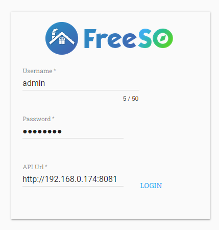
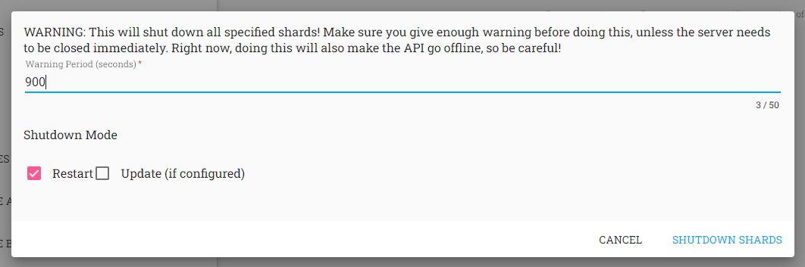
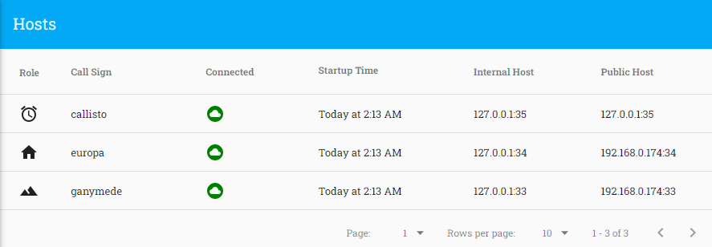
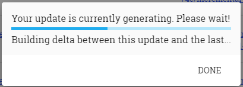

# Admin Webapp (and Updates)

The Admin Webapp is an angularjs project that can be used to manage the server from a web browser. It has a lot of shortcomings and needs to be rewritten entirely, but it _was_ used in the operation of the FreeSO Server, so it's worth talking about so you can use the same capabilities.

The most important thing you can do from this webapp is build updates to distribute to users, and schedule server restarts. While flawed, these tools are great for being able to iterate on the game quickly, pushing updates out to all of your players whenever you have the time for a server restart.

The last version of the webapp is hosted at https://freeso.org/fsoadmin2 . 

## Building the Admin Webapp (and why it needs replaced)

You can find the source for the Admin webapp in `TSOClient/FSO.Server/Admin`. This admin app was built with angularjs 1.6 (released in 2016!) and should build (with a lot of complaining) under node 20. Later versions may still work.

If you're not currently in the `node` ecosystem, I recommend starting with `nvm`/`nvm-windows` so that you can easily switch node versions between projects. The following instructions will assume you have it.

- Install node 20 with `nvm install 20` (only needs to be done once).
- Use node 20 with `nvm use 20`
- `npm i`
- `npm i -g bower` (only needs to be done once)
- `bower install`
- `npm run start`
  - This will build the application. It doesn't self host, sorry.

When the app is built, it will be available in `dist/`. To run the webapp, host it on some kind of webserver and browse to the URL. If you're on windows, you can use the `mongoose-free-6.5.exe` executable that you will see has made its way into your dist folder.

AngularJS is very dead now - it has been fully replaced by newer versions of Angular that work entirely differently. Modern web development uses typescript - a much better fit for a project like this where you're passing around API data that you'd like to have a type definition for.

I would recommend rebuilding the app in a more modern web framework like React, or even just modern Angular. Type definitions also help new developers get acquainted with projects, rather than having to jump around the codebase to see exactly what fields an object is meant to have, or even what their values can be.

There are a lot of functional problems like the app like not even paginating on any of the things it lists. It's not _really_ necessary, but it does mean the app is only useful for performing actions rather than checking anything, which means you need to connect to and query the database.

## Login

When you first open the webapp, you'll be greeted by the login page. You should enter credentials for an ingame user with `is_admin` and `is_moderator` both set to 1, so you can use all features. See the Database Manipulation document for more information.

You must set your API URL to match your server. If you're connecting over the internet, this should be an HTTPS URL so that nobody can intercept your credentials as they are sent to the server (all your players should also be connecting via HTTPS...).

If your server is not using HTTPS (bad) or you're connecting to the server locally, an HTTP URL can work, though the browser can fail and complain about mixed content when trying to connect if the webapp is accessed using `https://`. If your server API is on `http://`, then the admin webapp must also be on `http://` to avoid this issue.

## Lists and management

After logging in, you'll see a list of pages down the left hand side for various things that the server manages. Click on each to go to a page dedicated to it.

### Users

This page _should_ list all users in the database. It actually just lists the first page. This isn't particularly useful, but the button at the bottom right to _add_ a user is.

Here, you can manually add a user with any username, email and password. You can also give them admin or moderator rights, so it's easy to make more accounts for yourself.

Very important note - PLEASE do not ask users to sign up for your server by sending you passwords and having you directly give them accounts. This is a data privacy nightmare, and if the EU finds out you are doing this they will skin you alive. Plaintext passwords are not to be stored longterm _anywhere_, especially in Discord's servers.

For setting up user registration, see the Registration documentation.

### Shards

This page lists all shards. A shard equates to a city from a user perspective. After selecting a shard, click the button on the bottom right to open the tools menu.

From the tools menu, you can send an announcement to a shard, or shut the server that's hosting it down. Announcements should be delivered to all players connected to the city server.

Shutdowns are scheduled to happen some time after the request, with periodic reminders for users that are still connected to the game. Try to make shutdown timers relatively long (15 minutes, maybe 5 if you're in a hurry) so players aren't unexpectedly interrupted while they're doing something important.

The shutdown isn't really tested when running multiple shards - right now a lot of things assume that the API server runs on the same box as the city server, so it will probably misbehave if that isn't the case.

The "update" and "restart" shutdown modes provide hints that tell the watchdog what to do. I can't remember how much of this was implemented - typically I would leave it as is with Restart checked and the server would auto-update if there were one scheduled.

### Hosts

This page lists all active hosts. By default, your server will have one host of each type, but there is the possibility of running hosts on different servers to distribute lot server load. See Server Configuration for more details.

### Tasks

This page lists a history of all Tasks performed on the server. All the tasks the server currently runs should be run periodically, see Server Configuration to see what these are and how they are set up.

Using the plus button at the bottom right, you can manually run any task that the Task Server supports. 

Note that the options "Multiaccount Analysis" and "Prune Abandoned Lots" are not implemented. The first was done using an external tool developed by Sim, and a system to do the second was never devised.

## Updates

See the Updates documentation for more information.
