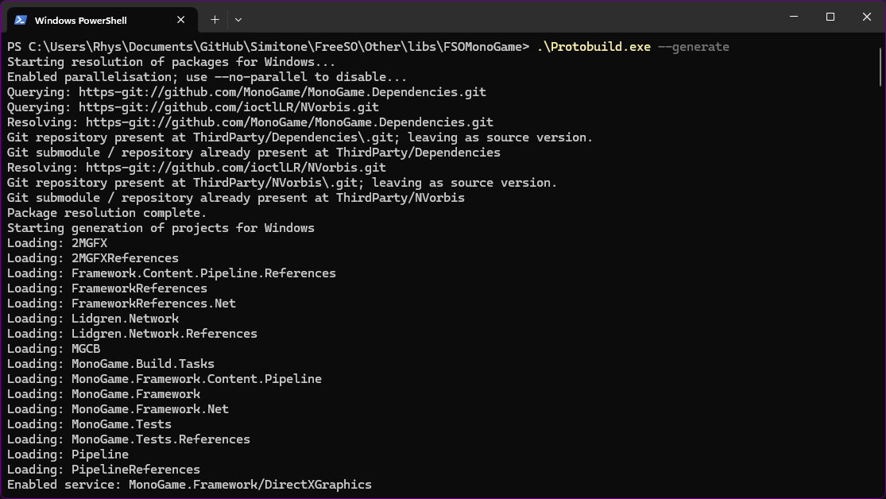
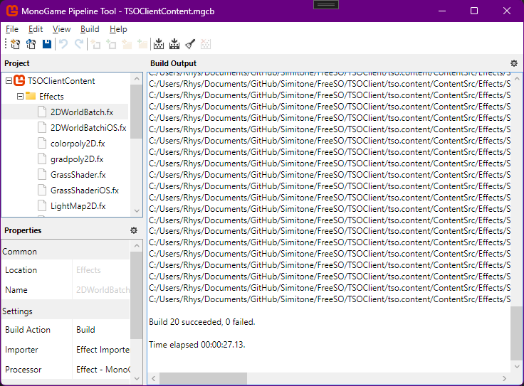

# Building FreeSO

FreeSO is typically built with Windows and Visual Studio, even on CI. Running the client/server on Linux and Mac has always been done by running the Windows binaries with mono or `dotnet exec` for the client and server respectively.

## Requirements

- Visual Studio 2019/2022
- Git (downloading the project as zip may not include submodules like monogame)
- .NET Framework 4.5 Targeting Pack (client/server)
- .NET Core 2.2 (server)

## Visual Studio 2022 setup

Visual Studio 2022 doesn't come with a .NET Framework targeting pack, and at a glance it has been removed from the page that it directs you to. However, you can still source and add support manually, as shown by [this StackOverflow question](https://stackoverflow.com/questions/70022194/open-net-framework-4-5-project-in-vs-2022-is-there-any-workaround):

- Download the [Microsoft.NETFramework.ReferenceAssemblies.net45](https://www.nuget.org/packages/microsoft.netframework.referenceassemblies.net45) package from nuget.org
- Open the package as a zip (you may have to rename it to .zip)
- Copy the files from `build\.NETFramework\v4.5\` to `C:\Program Files (x86)\Reference Assemblies\Microsoft\Framework\.NETFramework\v4.5`
- Reopen Visual Studio

After all this, you should be able to build the project without it complaining about a missing targeting pack.

This trick might work with future Visual Studio, but eventually it might just be a better idea to port to modern .NET and x64. This will drop support for Windows Vista, Windows 7 and Windows 8, though that's probably a good thing as nobody should be using those OS in <current year> for security reasons.

## Build Process (Windows)

First, make sure you have cloned FreeSO _with_ submodules. If the folder `./Other/libs/FSOMonoGame/` is empty, you haven't don it right.

Next, you want to run `.\Protobuild.exe --generate` from the directory `./Other/libs/FSOMonoGame/`. This will generate the Monogame projects that FreeSO uses.

You can now open the FreeSO solution and build it in Visual Studio. Open `./TSOClient/FreeSO.sln`, and you should be ready to go.

Change the active project to change which aspect you build:
- `FSO.Windows`: The FreeSO client, targeting windows.
- `FSO.IDE`: The FreeSO client with Volcanic.
  - This is the version distributed to players on the official server, though most players just launched via FreeSO.exe (FSO.Windows, which is included in this project) rather than `Volcanic.exe`.
  - Don't always use this startup project - the IDE can crash on server by running out of memory very quickly, or simply because it's not meant to be used in Multiplayer.
- `FSO.Server.Core`: The FreeSO server, running under .NET Core 2.2. This builds `FSO.Server.Core.dll`, which you must launch with `dotnet exec` or via Visual Studio.
- `FSOFacadeWorker`: A worker application that builds 3D thumbnails for properties that have been updated since their last thumbnail upload. A bit memory hungry, so closes itself after processing a few.
- `FSO.Server.Watchdog`: A helper application that tries to self-update using update data downloaded by the main server. Launch with `--core` for FSO.Server.Core.

Building in Debug does make it a lot easier to make changes and debug when anything goes wrong, but it impacts performance very significantly. Don't distribute a debug build to players.

## Content Build

The FreeSO repository includes built versions of Monogame content for DX, OGL and iOS, but if you make any changes to shaders or fonts you'll need to rebuild them. You can build these yourself by building and running the MonoGame Pipeline Tool by opening `./Other/libs/FSOMonoGame/Monogame.Framework.Windows.sln`, selecting `Pipeline.Windows` as the startup project and running it.

You can find the FreeSO content projects for each target in `TSOClient/tso.content/ContentSrc/`:

- TSOClientContent.mgcb: OpenGL content
- TSOClientContentDX.mgcb: DirectX content
- TSOClientContentiOS.mgcb: iOS content. Not really used now - makes some changes to shaders for OpenGL ES 2.0 support.

## CI

FreeSO has an Azure pipeline for automated builds - the configuration is located here:

https://github.com/riperiperi/FreeSO/blob/master/azure-pipelines.yml

Particularly important is the VM image `windows-2019`, used to avoid the targeting pack issue that occurs with newer versions of Visual Studio. It's possible a similar workaround could be used on later images, but I just froze it to make sure it didn't break again.

These were part of the update pipeline for the official FreeSO server, and is still active and building any changes made now.

It would probably be a good idea to get something similar running under GitHub Actions.