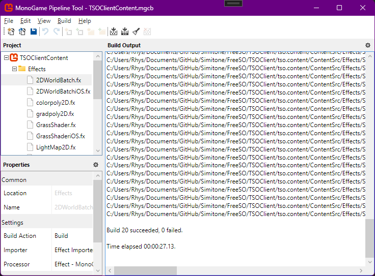

# Building FreeSO

FreeSO is typically built with Windows and Visual Studio, though you can build for any platform with the .NET CLI.

## Requirements

- Visual Studio 2026
- Git (downloading the project as zip may not include submodules like monogame)
- [.NET 9 SDK](https://dotnet.microsoft.com/en-us/download/dotnet/9.0) 

## Build Process (Windows)
Open `./TSOClient/FreeSO.sln` in Visual Studio, and you should be ready to go.

Change the active project to change which aspect you build:
- `FSO.Windows`: The FreeSO client, targeting windows.
- `FSO.Unix`: The FreeSO client, targeting mac and linux.
- `FSO.IDE`: The FreeSO client with Volcanic IDE. Windows only.
  - This is the version distributed to players on the official server, though most players just launched via FreeSO.exe (FSO.Windows, which is included in this project) rather than `Volcanic.exe`.
  - Don't always use this startup project - the IDE can crash on server by running out of memory very quickly, or simply because it's not meant to be used in Multiplayer.
- `FSO.Server.Core`: The FreeSO dedicated server.
- `FSOFacadeWorker`: A worker application that builds 3D thumbnails for properties that have been updated since their last thumbnail upload. A bit memory hungry, so closes itself after processing a few.
  - With changes added alongside the archive mode, 3D lot facades should automatically populate without running this tool, but you can still use it to refresh thumbnails and facades.
- `FSO.Server.Watchdog`: A helper application that tries to self-update using update data downloaded by the main server. Launch with `--core` for FSO.Server.Core. Not really used anymore.

Building in Debug does make it a lot easier to make changes and debug when anything goes wrong, but it impacts performance very significantly. Don't distribute a debug build to players.

## Content Build

The FreeSO repository includes built versions of Monogame content for DX, OGL and iOS, but if you make any changes to shaders or fonts you'll need to rebuild them. You can build these yourself by building running the MonoGame Pipeline Tool. 

- Open the `TSOClient/` folder in a terminal, and run `dotnet tool restore`. 
- Run `dotnet tool run mgcb-editor` to open the pipeline tool.

You can find the FreeSO content projects for each target in `TSOClient/tso.content/ContentSrc/`:

- TSOClientContent.mgcb: OpenGL content
- TSOClientContentDX.mgcb: DirectX content
- TSOClientContentiOS.mgcb: iOS content. Not really used now - makes some changes to shaders for OpenGL ES 2.0 support.

## CI

FreeSO uses GitHub Actions to build client and server executables for Windows, Mac and Linux. There are some additional scripts that help publish builds as updates with delta patches and installers: `FSO.UpdateBuilder` and `FSO.UpdateWorker`.

Check out the [Updates](./Updates.md) page for more information on setting up an update channel from a GitHub repository.