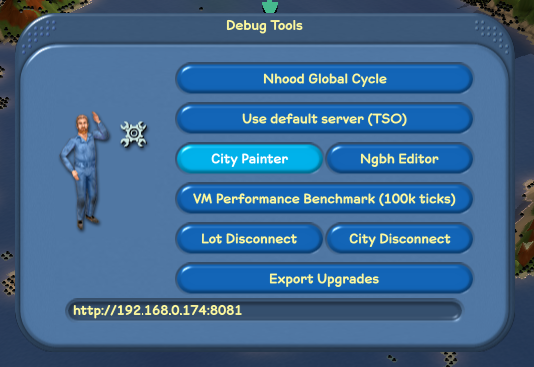
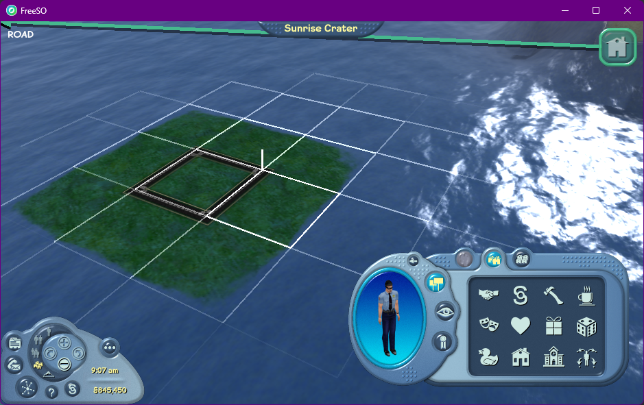
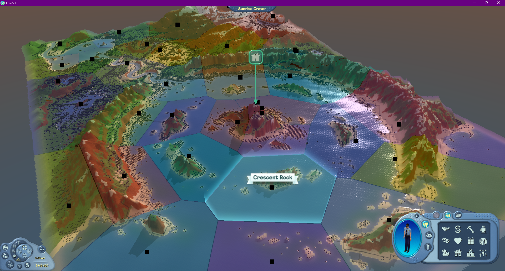

# Crafting a City

Cities in The Sims Online are simply a collection of images that combine to create the terrain that you see ingame. FreeSO adds its own city with the client, `0100`, which is the Sunrise Crater city created by myself using Test Center as a base. However, The Sims Online comes with 30 different city maps, from `0001` to `0030`, which you can use as a starting point for your server.

The original Cities in The Sims Online are notably less decorated than Sunrise Crater, but using some ingame tools and performing some image editing, you can shape any city to have its own nuanced road and neighbourhood layout for players to create communities within. This section will describe some tools and techniques that were used in the creation of Sunrise Crater.

You can see all of these original cities at `Maxis\The Sims Online\TSOClient\cities\`. Have a good look at how the map data is structured.

You should have a server fully set up to get started, as you need to be able to enter city view to use the City Painter and Neighbourhood Editor tools.

Accessing these tools can be done by pressing CTRL-F1 while in the city view. You can see two buttons for the City Painter and Neighbourhood Editor tools. Clicking on one will activate it on the city view, which replaces its normal interaction of selecting/purchasing properties.

## City Painter

The city painter is a collection of tools that allows you to modify an existing city to suit your needs. The current tool is printed at the top left of the screen: "ROAD", "TERRAINTYPE", "ELEVATION_CIRCLE", "ELEVATION_FLAT", "FORESTTYPE", "FORESTDENSITY", and can be changed by pressing... a set of very unintuitive keys. Here's a list:

### Controls

- Press the Up or Down keys to change the current brush size. This will change each tool's affected area. Each tool will show you the current brush size's affected area, so don't worry about forgetting what it's set to.

- "R": Road:
  - Click and drag on the map to place roads on tile edges. These can only be in the four cardinal directions, and can obviously only be on edges.
  - Hold control while dragging to instead erase a road. This might mess up your road corners, so replace any roads by clicking and dragging over them again if anything looks broken.
- "T": Terrain Type:
  - Click and drag on the map to set the terrain type of hovered tiles. The colour of the tile indicates the terrain type that you're placing. Press keys on the numpad to change which terrain type is active:
    - 0: Grass
    - 1: Water
    - 2: Rock
    - 3: Snow
    - 4: Sand
- "E": Elevation (Circle)
  - Click and hold to move the elevation up around at the specified tile. You can move the cursor while doing this, and brush size creates a large spherical brush that's useful for modifying large areas.
  - Hold control to lower the elevation instead.
  - Hold shift to raise the elevation faster.
- "F": Elevation (Flat)
  - Click and hold to move elevations towards the average around the specified tile. You should set brush size to a larger value. You can move the cursor during this.
  - Useful for creating flat areas on hillsides and hilltops.
  - Hold control to... do it faster.
- "C": Forest Type
  - Click and hold to set the forest type of hovered tiles. Press keys on the numpad to change which forest type is active:
    - 0: Fir Tree
    - 1: Birch Tree
    - 2: Cactus
    - 3: Palm Tree
    - 4: Clear
  - Note that this won't appear to do anything without forest density.
- "D": Forest Density
  - Click and hold to set the forest density of hovered tiles. Press keys on the numpad to change how dense it should be:
    - 0: 0% density
    - 1: 25% density
    - 2: 50% density
    - 3: 75% density
    - 4: 100% density
  - Note that this won't appear to do anything without forest type.

### Save/Load

Saving and loading is an important part of editing a city, as there is no undo/redo feature. Keys F2 through F10 will access save states that you can use to save the city as you make progress, and potentially revert to a previous version if you're unhappy with your changes.

- Shift + F#
  - Save the current state of the city to `Content/CityPainterSave#/`, where # is replaced with the number of the F key you pressed.
- F#
  - Load the current state of the city from `Content/CityPainterSave#/`, where # is replaced with the number of the F key you pressed.
  - Reloading the game will always load the city that the server specifies, so you'll need to do this to continue editing if you close the game.

When you're finished editing your city, the contents of `Content/CityPainterSave#/` should be copyable into an actual city folder for use on a server.

### Notes

You can see that this tool is a usability nightmare. It was never intended for public use, and could really do with a proper UI component... or some additional quality of life features. Feel free to develop this to be an actual user facing feature.

The performance of this tool is also not great. You'll have to excuse that - it was designed for an older version of the city view that didn't have the subdivision surfaces that the newer one does. It was also designed back when 2D mode was the only option, so it can be a little hard to use some tools when at non-isometric angles.

### Vertex Colours

While you can modify terrain types and forest density with the City Painter, the colour of the terrain is influenced by something called the "vertex colour", a colour that is multiplied with the terrain texture to create the final look on the city view. This creates deeper greens in grassy areas, and deeper blues in deep sea areas.

Have a look at `vertexcolor.bmp` for both your base map and other maps to get a good idea of how they're meant to look, comparing to the `terraintype.bmp` image for each. You'll need to edit your `vertexcolor.bmp` manually to get a result looking as good as the originals, so prepare your artistic talents.

All tiles on all maps match, so a good first step is to use the terrain type graphic as a guide for which areas you want to alter the colour for, of course remembering what modifications you have made to the map that need to be corrected in the vertex colour. Try to apply your changes with a modest gaussian blur, and keep checking ingame to see if the results look good. It doesn't have to be perfect, you just need your sand to not look solid blue.

### Importing into your server

Unfortunately, the server _cannot currently distribute custom city maps_. You'll need to bundle custom cities with both the client and server that you are using.

Place your custom city in the `Content\Cities\` folder of both the client and server, with a name like `city_0101`. You can then update your shard in `fso_shards` to point to the `map` `0101` (or whatever you chose) using an SQL query or database tool.

When you log into the game, you should see your custom map, and all lot purchases should properly adhere to it. (lot terrain matches, road edges match, etc).

### Map changes with existing lots

It's pretty obvious that changing the map from under a server with existing lots can create some weird situations. For a start, all lots will stay at their old position on the new map. This could mean that some lots exist entirely over water, or their corner elevations mismatch, which will cause them to disconnect from the map at the edges.

Moving these properties can resolve this issue, as then the property will re-initialize its terrain to match the new location. You can move properties _in place_ by setting `move_flags` to `1` on the `fso_lots` table, though this will still flatten the buildable area of the lot, similar to moving to another location.

I would recommend only opening your city when you're happy with how the map looks, to avoid any issues caused by changes you make in the future.

## Neighbourhood Editor

The Neighbourhood Editor is a simple tool that lets you define and preview the boundaries for neighbourhoods in your city. Each neighbourhood has a single origin point, and every single tile on the map will pick the closest neighbourhood origin to be its assigned one.

There are a few things you can do in the neighbourhood editor:

- Click & Drag any point
  - Move a neighbourhood's origin point to the mouse position. The neighbourhood visualization will update to show you what area of the city belongs to which neighbourhood.
- Hold shift & Click
  - Create a new neighbourhood at the mouse position.
- Hold ctrl & Click
  - Delete the neighbourhood at the mouse position. Needs to be pretty close.
- Press "R"
  - Rename the neighbourhood closest to the mouse position.
- Press "C"
  - Change the color of the neighbourhood closest to the mouse position
- Press F10
  - Load the neighbourhood data from `Content/edit_neigh.json`. 
- Press Shift + F10
  - Save the neighbourhood data to `Content/edit_neigh.json`.

Similar to the City Painter, this tool is currently pretty user unfriendly, so improvements would definitely be welcome.

Descriptions for neighbourhoods also can't be edited ingame. Add a `description` field to each object in the JSON to give your neighbourhoods a description that appears in their nhood page. You can also do this in the database after importing.

### Importing into your server

Like the City Painter, changes are made entirely locally and saved to a local file. To use these neighbourhoods on your server, you should copy over the `edit_neigh.json` file to the server, and then run the `import-nhood` tool:

`dotnet exec FSO.Server.Core.dll import-nhood <shardId> <nhoodJson>`

Replacing the arguments with your target shard ID and JSON path as necessary.

This tool will enter your neighbourhoods into the database for you, automatically updating existing lots to point to the new neighbourhoods. Any additional configuration for the neighbourhood, such as whether it is reserved (only admins can purchase property) and forced mayors will have to be done after the fact.

## Upgrades

Upgrades are a feature added by FreeSO that allows users to upgrade objects with Simoleons to improve or add to their functionality. These upgrades essentially work by modifying a bunch of tuning parameters in the object itself, which are used by the scripts to determine things like how much motive gain an object should give when you use it.

The `upgrades.json` file in `Content/` will be automatically distributed to clients when they log into the server - no need to bundle this one with your client. The final version of this file from the FreeSO server's run is included in the content directory of both the client and server, and can be edited using Volcanic.