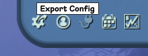
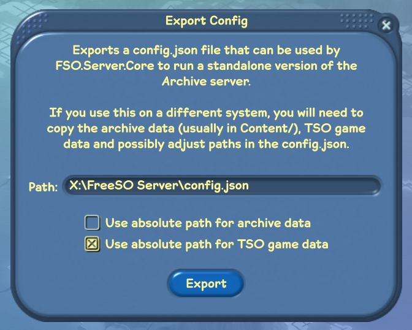

# Download the FreeSO Dedicated Server

You can find download links for the Dedicated Server [immeditately below the client downloads](https://freeso.org/download#dedicated-server), or on the [latest release on GitHub](https://github.com/riperiperi/FreeSO/releases). You'll still need an install of **The Sims Online**, so if you want to run the server on another machine you'll need to copy over The Sims Online from your local installation.

Note that right now, the server software doesn't have an automated update system... you'll need to download and extract game updates manually with the server offline.

# Dedicated Archive Server

The quickest way to get started hosting a dedicated Archive mode server is to simply export the server configuration from the FreeSO client, and drop it (`config.json`) into the dedicated server folder.

The default exported configuration will use the same path for The Sims Online as your game client, but will use a relative path (like `Content/ArchiveCities/FreeSO Archive`) for the save data, so you'll need to _copy or symlink_ your saves into the server's content directory.

- If you're on the same machine, and don't want to duplicate your save data, then you can check the box **"Use absolute path for archive data"**, which will make the server access the archive data directly from the client content folder.
- If you need to change the archive data path manually, then you'll need to change both the `simNFS` and `connectionString` to point to the new path.

If you're on an entirely different machine, then you'll need to copy the save _AND_ The Sims Online, then change `gameLocation` in `config.json` to match where you've copied The Sims Online to.

Also, UPnP currently does not work on the Dedicated Server, so you should look into forwarding ports manually. You can configure the manually hosted ports before exporting the configuration, or change them in the `config.json`.

# Dedicated MMO Server

While our official MMO server has been sunset, the FreeSO client and server will always support running in its original MMO form. However, since the server was built as a distributed system (lot, city, task and database servers are separate), setting up all of the components is a lot trickier.

## config.json

After obtaining and extracting the dedicated server, you need to initialize your `config.json` file. Here's a handy guide:

1. Copy `config.sample.json` to `config.json`.
2. Change `gameLocation` to a relative path to your TSO install. This folder should have the contents of `TSOClient`, so if `./game/tuning.dat` exists, then you should put `./game/` in this field.
3. Change `simNFS` to a relative path to a folder where you want to store lot and object saves, as well as lot thumbnails. If you have a distributed server setup, this should be on a network drive.
4. Change the secret to something unique. If you don't do this, other people will be able to impersonate your city/lot servers and cause havoc.
  - This should be a random 64 character hex string. I'm sure you can find a generator.
5. Configure database (see [Database Setup](./Database%20Setup.md))
  - The most important thing is setting your connection string to match your database setup.
6. Configure servers (see [Server Configuration](./Server%20Configuration.md))
  - The most important thing is changing the `public_host` fields for everything _except_ the task server to match your server's public IP. (the endpoint through which game clients will connect to your server)

That should be the long and short of it. After this, your server can be started with the executable:

`./FSO.Server.Core.exe` (windows)
`./FSO.Server.Core` (other)

Players should be able to connect by adding your API url (with http(s)) on the Join Server dialog, after which it should show up in their server list each time they start the game.

## City Editor

While the City Editor can't be used in MMO mode, you can create a city in Archive mode then copy the city data to your MMO server's NFS directory.

To do this, copy `City1` in the Archive save folder to your MMO server's NFS directory. In the database, change your shard's map to `dynamic`, and rename the `City1` folder to use your shard ID if it's not 1 for whatever reason.

## Bogus Update Request

If your client version string is different from the server, it will ask you to update. You can ignore this by holding shift and clicking "Cancel" on the dialog. See the [Updates](./Updates.md) documentation for more information on properly configuring updates.

## Followup

- [Server Operation Guidelines](./Server%20Operation%20Guidelines.md): Behind the scenes advice on running a FreeSO Server.
- [Registration](./Registration.md): Information about setting up a registration page for your server.
- [Updates](./Updates.md): Information about setting up your own update channel.
- [Admin Webapp](./Admin%20Webapp.md): Information about controlling the server via the Admin Webapp.
- [Database Manipulation](./Database%20Manipulation.md): Information about controlling city behaviour.
- [Tuning](./Tuning.md): Information about controlling city tuning.
- [Generating Archive Data](./Generating%20Archive%20Data.md): How to convert your FreeSO MMO server into an Archive save.