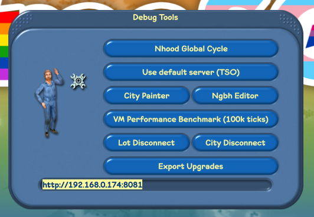

# Initial Setup

Setting up the FreeSO server is very similar to setting up the FreeSO client, to a point. You need the following to run it at all:

- .NET Core 2.2.207
- A compiled `FSO.Server.Core`.
- A copy of The Sims Online, in a folder specified by `gameLocation` in `config.json`.
- An "nfs" directory where you want the server to store lot and object saves.
- Create and fill out `config.json`.

## .NET Core 2.2

You can find installers for Windows and instructions for Linux here:

https://dotnet.microsoft.com/en-us/download/dotnet/2.2

FreeSO is built with .NET Framework 4.5, but the server runs on .NET Core 2.2 for improved compatibility with Linux and to use the new ASP.NET backend.

## FSO.Server.Core

The FreeSO code should work on all platforms, assuming that you have dotnet core sdk installed. You can find the latest builds of the official repository using these cloudflare handlers. Eventually, these will move to a GitHub release.

### Client

https://fso-builds.riperiperi.workers.dev/

### Server

https://fso-builds.riperiperi.workers.dev/?mode=server

### Custom Build

If you wish to make code changes to the client or the server, see the Building FreeSO documentation.

## The Sims Online

FreeSO requires The Sims Online `1.1097.1.0`, which can be downloaded from here: https://archive.org/details/TheSimsOnline_2002

There's also another version floating around with identifier `1.1239.1.0`. If you try to use this version with the FreeSO client, it will be able to patch it to be the same as the old version through a delta patch. You can then use this patched version on the server.

## config.json

With everything now in place, you need to initialize your `config.json` file. Here's a handy guide:

1. Copy `config.sample.json` to `config.json`.
2. Change `gameLocation` to a relative path to your TSO install. This folder should have the contents of `TSOClient`, so if `./game/tuning.dat` exists, then you should put `./game/` in this field.
3. Change `simNFS` to a relative path to a folder where you want to store lot and object saves, as well as lot thumbnails. If you have a distributed server setup, this should be on a network drive.
4. Change the secret to something unique. If you don't do this, other people will be able to impersonate your city/lot servers and cause havoc.
  - This should be a random 64 character hex string. I'm sure you can find a generator.
5. Configure database (see Database Setup)
  - The most important thing is setting your connection string to match your database setup.
6. Configure servers (see Server Configuration)
  - The most important thing is changing the `public_host` fields for everything _except_ the task server to match your server's public IP. (the endpoint through which game clients will connect to your server)

That should be the long and short of it. After this, your server can be started with the dotnet command:

`dotnet exec FSO.Server.Core.dll`

## Client Prep

To connect to your custom server, press F1 on the login screen and change the URL in the text box to match your API server endpoint. This will update your client configuration to connect to this server every time. If you want to distribute a client made for a specific server, you should overwrite this URL in the default config.

## Bogus Update Request

If your client version string is different from the server, it will ask you to update. You can ignore this by holding shift and clicking "No" on the dialog. See the Updates documentation for more information on properly configuring updates.
