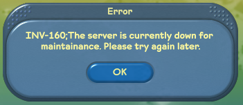

# Server Configuration

The server is configured by `config.json` in the same folder as the server binaries. On a fresh install, you'll need to copy `config.sample.json` to get started with your own configuration.

This document will go over each section of the config JSON, describing what the sample configuration does, and what functionality you can change.

## Core Configuration

See `Initial Setup`, `Database Setup` for more information.

```json
{
  "gameLocation": "./game/",
  "secret": "38F7E3B816EF9F31BFAB8F4C9716C90D106BD85E9D6913FBB4D833C866F837B0",
  "simNFS": "./nfs",

  "database": {
    "connectionString": "server=127.0.0.1;uid=fsoserver;pwd=password;database=fso;"
  }
}
```

`gameLocation` is a relative path to your TSO install. This folder should have the contents of `TSOClient`, so if `./game/tuning.dat` exists, then you should put `./game/` in this field.

`secret` is a unique 64 character hex string that distributed parts of your server use to authenticate with each other. This must be changed. If you don't do this, other people will be able to impersonate your city/lot servers and cause havoc.

`simNFS` is a relative path to a folder where you want to store lot and object saves, as well as lot thumbnails. If you have a distributed server setup, this should be on a network drive.

`connectionString` is a string that allows the game to connect to the database.

## Services

```json
"services": {
  //...
}
```

Each instance of the server software can host a number of services that can connect via a distributed server setup. The sample configuration has the server host one of each service on a single instance.

Shared between most services, you will find the following properties:

```json
{
  "call_sign": "ganymede",
  "binding": "0.0.0.0:33100",
  "internal_host": "127.0.0.1:33",
  "public_host": "127.0.0.1:33",
  // "certificate": "auth.east.ea.com.pfx",
}
```

The `call_sign` uniquely identifies the server with a name that will be printed in logs relating to that server.

`binding` is the TCP binding that the service will host. The binding should end in `100` and is the endpoint the server uses for TLS communications, if a certificate is provided. A plain (non-TLS) binding is also opened by replacing `100` with `101` in the binding address - so the example will listen for plain TCP on `0.0.0.0:33101`.

`internal_host` is the TCP binding that internal servers will try to connect to. They will always attempt to communicate over the plain `xx101` port right now, so `101` is added to the host to get the final endpoint.

`public_host` is the TCP binding that clients will try to connect to. This will be exposed to users when in the city selector (for city servers) and when joining a lot (for lot servers). `101` is added to the host to get the plain endpoint, and `100` for TLS.

`certificate` is used for TLS connections (encrypted). This was not used by the main server - only authentication was done over SSL. It would probably be a good project to get this working with a service like LetsEncrypt that can provide a legitimate, rotating SSL certificate you could use for the game servers.

### Task

```json
    "tasks": {
      "enabled": true,
      "call_sign": "callisto",
      "binding": "0.0.0.0:35100",
      "internal_host": "127.0.0.1:35",
      "public_host": "127.0.0.1:35",
      // "certificate": "auth.east.ea.com.pfx",
      "schedule": [
        {
          "cron": "0 3 * * *",
          "task": "prune_database",
          "timeout": 3600,
          "parameter": {}
        },
        {
          "cron": "0 4 * * *",
          "task": "bonus",
          "timeout": 3600,
          "shard_id": 1,
          "parameter": {}
        },
        {
          "cron": "0 4 * * *",
          "task": "job_balance",
          "timeout": 3600,
          "parameter": {}
        },
        {
          "cron": "0 9 * * *",
          "task": "shutdown",
          "timeout": 3600,
          "parameter": {}
        },
        {
          "cron": "0 0 * * *",
          "task": "neighborhood_tick",
          "timeout": 3600,
          "run_if_missed": true,
          "parameter": {}
        },
        {
          "cron": "0 0 * * *",
          "task": "birthday_gift",
          "timeout": 3600,
          "run_if_missed": true,
          "parameter": {}
        }
      ],
      "tuning": {
        "bonus": {
          "property_bonus": {
            "per_unit": 10,
            "overrides": {
              "1": 1500,
              "2": 1250,
              "3": 1000
            }
          },
          "visitor_bonus": {
            "per_unit": 8
          }
        },
        "birthdayGift": {
          "items": [
            {
              "age": 1000,
              "guid": 1303919565,
              "mail_subject": "1000 Days!",
              "mail_message": "This is an example gift that shows how birthday gifts can be awarded by the server at different milestones - this one is for 1000 days. Please change this message. Or leave it the same, I don't mind.\n - Rhys",
              "mail_sender_name": "FreeSO Developers"
            }
          ]
        }
      }
    }
```

There should only be one task server for a server cluster, so they aren't specified as an array. Set `enabled` to false to disable the functionality.

Task servers are given a `schedule` and `tuning` required to perform tasks.

#### Schedule

Task schedules control when tasks automatically happen during server operation. You can actually remove all of these and just fire tasks manually, but that would be a lot of work.

Here's an example schedule:

```json
{
  "cron": "0 0 * * *",
  "task": "neighborhood_tick",
  "timeout": 3600,
  "run_if_missed": true,
  "parameter": {}
}
```

`cron` specifies the time at which the task runs. Here is a helpful diagram that I stole from Google:

```
|------------------------------- Minute (0-59)
|     |------------------------- Hour (0-23)
|     |     |------------------- Day of the month (1-31)
|     |     |     |------------- Month (1-12; or JAN to DEC)
|     |     |     |     |------- Day of the week (0-6; or SUN to SAT; or 7 for Sunday)
|     |     |     |     |
|     |     |     |     |
*     *     *     *     *
```
For all the tasks specified in the sample configuration, we want them to happen on minute 0 on a specific hour every day. You can see that the last 3 fields are `*`, which means that they happen on every day of the month, month, and day of the week.

`task` specifies the task type. The following tasks are implemented:
- `prune_database`:
  - Purges old entries in `fso_auth_tickets`, `fso_shard_tickets`, `fso_lot_visit_totals`, `fso_bonus`, `fso_lot_visits`, and `fso_transactions`.
- `bonus`: 
  - Calculates top 100 and lot visit bonuses for the given `shard_id`. 
- `shutdown`:
  - Shuts down the server, with the given warning period in seconds specified by `tuning.shutdown.warning_period`. Defaults to 15 minutes.
- `job_balance`:
  - Automatically balances singleplayer job objects based on popularity. More popular job objects have a lower payout, and more popular ones have a much higher payout. One object is selected as the "bonus" object.
  - Configured by `jobBalance` tuning. See below for more information.
- `neighborhood_tick`:
  - Notifies all city servers to process daily neighbourhood tasks. Includes neighbourhood elections, neighbourhood rankings etc.
- `birthday_gift`:
  - Awards users over a specified age with a birthday gift, and sends them an ingame mail message.
  - Configured by `birthdayGift` tuning. See below for more information.
  - This uses the events system with a pseudo-event with name `bday_<age>`, where `<age>` is the starting age in days when the gift is given.

`timeout` specifies how long the task is allowed to take in seconds. Defaults to 3600 (one hour)

`allow_task_overlap` specifies if a task is allowed to run if there's a previous instance already running. This defaults to false.

`run_if_missed` runs the task at startup if a previously scheduled execution of the task did not happen, usually due to server downtime. This defaults to false.

`shard_id` specifies the shard that the given task operates on. Only `bonus` task uses this.

`parameter` contains generic parameters for tasks, passed to the task as a JSON action. Not used right now.

#### Tuning

Tuning only exists for some tasks. It is used even when the task is fired manually from the API. Here are examples from the sample config:

```json
{
  "bonus": {
    "property_bonus": {
      "per_unit": 10,
      "overrides": {
        "1": 1500,
        "2": 1250,
        "3": 1000
      }
    },
    "visitor_bonus": {
      "per_unit": 8
    }
  }
}
```

`bonus` tuning affects the `bonus` task. This controls how much a lot's top 100 placement and visitor hours contribute to the bonus that the owner receives.

`property_bonus` controls how the top 100 placement affects the bonus:

- `per_unit` is awarded for each placement above 100th that the lot takes. A lot in 5th place would take `(100 - 5 + 1) * per_unit` simoleons as a property bonus, so 960 simoleons.
- `overrides` allow a specific amount of money (ideally higher) to be provided for specific placements. The default configuration specifies special payouts for 1st, 2nd and 3rd place.

`visitor_bonus` controls how the visitor hours affect the bonus:

- `per_unit` is awarded for each visitor hour. A visitor hour is an hour spent on a property by a visitor. If you have 20 visitors on a property for a whole hour, then you get 20 visitor hours in that one real hour.

Visitor hours can be scaled for specific category types by tuning in `fso_tuning`. See the Tuning doc for more information.

```json
{
  "shutdown": {
    "warning_period": 900
  }
}
```

`shutdown` tuning is for the `shutdown` task, and controls how long in seconds after the task fires that the shutdown really happens. This isn't specified in the sample configuration, so uses the default period of 15 minutes.

### UserApi
The UserApi is an HTTP server that provides authentication, admin API and other useful functions. For more information, see the API Endpoints documentation.

```json
    "userApi": {
      "enabled": true,
      "bindings": [
        "http://+:9000/"
      ],
      // "cdnUrl": "http://0.0.0.0:9000",
      "maintenance": false
    }
```

`enabled` controls whether the API server is actually enabled.

`bindings` controls the hostname bindings that IIS uses, though it only reads the first item in the array right now.

`authTicketDuration` specifies how long an auth ticket is valid for in seconds. Defaults to `300`.

`regkey` specifies a secret `key` string that must be passed to registration endpoints for them to work. Useful for implementing custom backend services for registration management. If not specified, a key is not required.

`maintenance` allows only authentication from moderators and admins while true. Defaults to `false`.

`updateUrl` specifies the update that users will be told to download to match the server version in simple update mode. See Update docs for more information.

`cdnUrl` specifies the API url that players download lot thumbnails and 3d facades from. You can put your API behind a CDN and place it in this field to get better performance in city view. Otherwise, it will default to the normal API url.

`useProxy` specifies whether the API server is behind a proxy. If this is true, then anywhere that tries to fetch the IP will get it from the `X-Forwarded-For` header. Make sure that your proxy server is writing this. Set it to `false` explicitly if you are not using a proxy (YOU SHOULD CONFIGURE ANOTHER WAY OF DOING HTTPS IF YOU DO THIS!). See the HTTPS Proxy doc for more information. Defaults to `true`.



#### Mail configuration

The API server can take an SMTP configuration to send verification emails for user registration. See the Registration doc for more information.

#### Filesystem configuration

The API server can take filesystem configurations to use for storing updates and update addons, and making them public. See the Updates doc for more information.

### Cities

City servers host a central connection for a single city. A server instance can host more than one city server, each with its own shard id.

```json
    "cities": [
      {
        "call_sign": "ganymede",
        "id": 1,
        "binding": "0.0.0.0:33100",
        "internal_host": "127.0.0.1:33",
        "public_host": "0.0.0.0:33",
        // "certificate": "auth.east.ea.com.pfx",
        "neighborhoods": {
          "mayor_elegibility_limit": 4,
          "mayor_elegibility_falloff": 4,
          "min_nominations": 2,
          "election_week_align": true,
          "election_move_penalty": 14
        }
      }
    ],
```

`id` determines the `shard_id` that the city server hosts. A shard is the database representation of a city.

`timeout_no_auth` true/false times out connections to the server if they don't authenticate in 20 seconds. Defaults to `true`.

#### Neighborhoods

Neighborhood configuration determines how election cycles work for neighbourhoods in this city.

`min_nominations` specifies the minimum number of nominations required to run for mayor. Defaults to `3`.

`mayor_eligibility_limit` specifies the number of neighborhoods on the top of the leaderboard to give election cycles. Should be less than or equal to falloff.

`mayor_eligibility_falloff` specifies how many neighbourhoods are allowed to retain elections. If a neighbourhood with elections falls beyond this level of popularity, elections are disabled and the mayor is removed.

`election_move_penalty` specifies the number of days you must wait after moving before participating in an election. Defaults to `30`.

`rating_move_penalty` specifies the number of days you must wait after moving before rating a mayor. Defaults to `7`.

`bulletin_move_penalty` specifies the number of days you must wait after moving before posting on a bulletin board. Defaults to `7`.

`bulletin_post_frequency` specifies the number of days you must wait between bulletin posts. Defaults to `3`.

`bulletin_mayor_frequency` specifies the number of days the mayor must wait between bulletin posts. Defaults to `1`.

`election_week_align` specifies if elections start on the last monday in a month, rather than 7 days before the end of the month. Defaults to `true`.

`election_free_vote` specifies if sims in areas without an election are offered a free vote. Defaults to `true`.

`vote_normal_value` specifies the value of a vote/nomination made by a resident. Defaults to `2`.

`vote_free_value` specifies the value of a vote/nomination made by a non-resident. Defaults to `1`.

### Lots
Lot servers run lot simulation on behalf of city servers, and users connect directly to them for lot gameplay. A server instance can host more than one lot server, but there's not really much need for that.

```json
    "lots": [
      {
        "call_sign": "europa",
        "binding": "0.0.0.0:34100",
        "internal_host": "127.0.0.1:34",
        "public_host": "0.0.0.0:34",
        // "certificate": "auth.east.ea.com.pfx",
        "max_lots": 25,
        "cities": [
          {
            "id": 1,
            "host": "127.0.0.1:33100"
          }
        ]
      }
    ]
```

`max_lots` configures the maximum number of lots that the lot server can host. If someone tries to host a lot on a city where _all_ of its lot servers are at capacity, they will be given a "city too busy" notification.

`ringBufferSize` configures the number of backup saves that a property maintains. Defaults to `10`.

`timeout_no_auth` true/false times out connections to the server if they don't authenticate in 20 seconds. Defaults to `true`.

`logJobLots` creates `fsor` recordings for job lot sessions. This was used for debugging issues early in job lot development, where users would infrequently get into situations where the lot reset or froze. You can play these back on sandbox mode on a client (in LocalHouse folder), though they are very likely to desync... especially if your client version differs. Defaults to `false`.

`cities` lists the city servers that the lot server expects to host lot simulation for. `id` should be its shard id, and `host` should be the internal host that the lot server connects to. Right now, it always replaces `100` with `101` to connect over plain rather than TLS.

`cityReportingInterval` configures how often in milliseconds that the lot server should report its current lot count and availability, as well as reconnect after losing connection with the city.

## Certificates and TLS

The server was originally developed with TLS support for interoperability with the original TSO client. However, that didn't last long and a lot of FreeSO's networking became custom, leaving this path behind. We only had SSL on authentication, using an HTTPS proxy that ran in front of the server using auto-renewing certificates from LetsEncrypt.

You can find some information on how to set up certificates in the `FSO.Server.Core` `Readme.md` file. However, TLS support has been untested for a while, Gluon (server to server) connections don't use it at all, and making your own root certificates will probably cause TLS authentication to fail on other machines.

It might be a good thing to try and fix TLS with LetsEncrypt renewal support, though.
