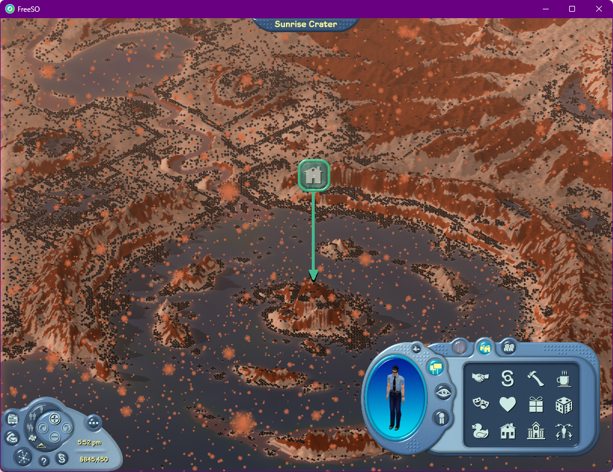
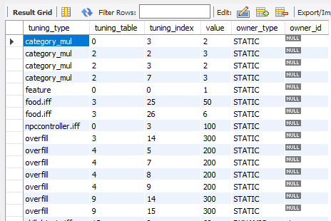
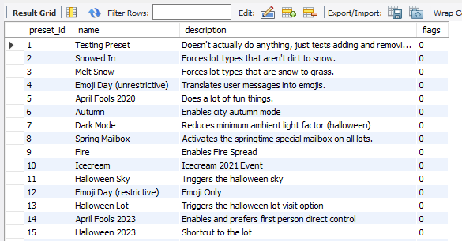
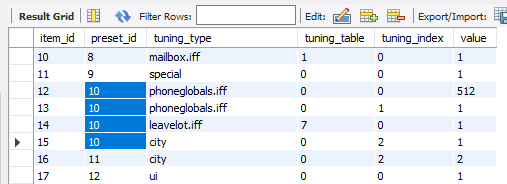
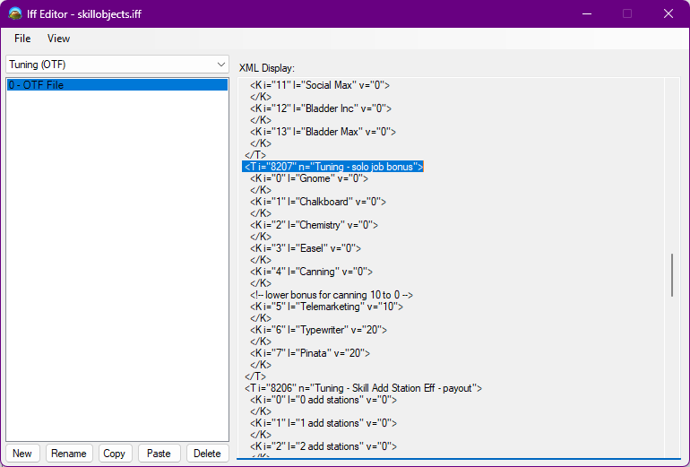

# Tuning

A lot of systems in the game have tunable parameters that can be changed by both developers adjusting features to deploy with updates, and the server at runtime.

All tuning comes in the following form:

`<ownerName> <table> <index> = <value>`

## Runtime Tuning Overrides

Note that tuning overrides via the `fso_tuning` table only sync when the lot is opened, or when an event begins/ends. This means you shouldn't expect lots to update in real-time if you're changing this in the database.

### Manually inserted in `fso_tuning` with type `STATIC`

You can manually insert tuning that applies to all lot types except job lots by adding rows in the `fso_tuning` table on the server with type `STATIC`. Here's a list of all the `STATIC` tuning that was on the FreeSO server:

You can find explanations for everything that this static tuning does in the sections below.

### `DYNAMIC` tuning in `fso_tuning` for dynamic job payouts

Dynamic job payouts update their own dedicated rows in the `fso_tuning` table. They specifically modify job object bonus values found in `skillobjects.iff`, the semi-global resource file shared by all job objects. The bonuses alter the base payout (the same flat value for every object) to consider both the time taken for the object to complete and its recent popularity. See the Task Server Configuration section for more information.

### `EVENT` tuning in `fso_tuning`

Event tuning is temporary tuning added by events specified in `fso_events`, where the tuning lasts for the duration of the event. With event type `obj_tuning`, you can specify a "tuning preset" to activate using the `value` field.

Tuning presets are collections of tuning values that can be activated/deactivated as a group, defined in the `fso_tuning_presets` table. Each preset can have a name and a description, and has an autoincrement id used to refer to it.

Actual tuning values for each preset are in the `fso_tuning_preset_items`, and have manually specified tuning to override and an attached `preset_id`.

### `/tuning` chat command

Any sim with admin rights can use the `/tuning` chat command to immediately set the tuning in any lot. The tuning will only apply to that property, making it useful to test tuning before applying it globally with an event or STATIC setup.

In most cases, this tuning will be overwritten whenever the lot closes and reopens, or if an event begins/ends with tuning that needs it to update across lots. You can use `/tuning forcedTuning 0 0 1` to disable this behaviour, but remember to disable it if you ever want the tuning to sync with the server on that lot ever again.

## Object Tuning

Tuning for ingame objects can be modified by any of these sources for tuning overrides. Tuning for objects is typically defined in the object IFF itself with the BCON (Behaviour Constants) chunk, or in a standalone OTF (Object Tuning File) file found separately from the IFF. Both of these share the same table index space.

OTF is typically used for variables that should be tuned, so you're more likely to want to modify these values. These are also a popular target for creating Upgrades, which also perform object tuning overrides.

Objects start at table index 4096, and Semi-Globals start at table index 8192. When you're setting these tuning constants using a dynamic override, the table id in the override is added onto this base _automatically_, so just remember that if your table index is 4098 on an object, you actually want to override table `2` (4098 - 4096).

Use the IFF filename _including_ the `.iff` extension as the owner name when making an override.

### Interesting object tuning

- `skillobjects.iff 15 <0-7>`
  - Tuning here is set automatically by the dynamic job payouts task. These overrides have a special type "DYNAMIC", so they can be easily replaced when new job payouts are calculated.
  - `skillobjects.iff` is a semiglobal file. In its object resources, this table is actually ID 8207.
- `food.iff 3 25 50`
  - FSO server tuning: Pizza food points from 33 to 50.
  - See food.otf, table 4099. Good example of messing with existing object tuning.
- `food.iff 3 26 6`
  - FSO server tuning: Pizza points per loop from 4 to 6.
- `npccontroller.iff 0 3 100`
  - FSO server tuning: Repairman hourly rate from 50 to 100.
- `phoneglobals.iff`
  - `0 0`: "Call Taxi/Go Somewhere Nice" location low 16-bits. (location & 0xFFFF)
  - `0 1`: "Call Taxi/Go Somewhere Nice" location high 16-bits. (location >> 16)
- `mailbox.iff`
  - `1 0`: Special graphic. 1 is for Spring, 2 is for Halloween.
- `leavelot.iff`
  - `7 0`: Special graphic. 1 is for Spring, 2 is for Halloween.
- `personglobals.iff`
  - `11 0`: April fools 2019 effect enabled if 1.

## Special Tuning

Some tuning has special behaviour coded directly into the game, rather than interacting with objects on the lot. Here is an exhaustive list:

- `category_mul`
  - `<mode> <category> <multiplier>` - Gameplay multipliers that apply to specific lot categories. 
    - <mode> 0: relationship scale, 1: skill/money scale (unimplemented), 2: visitor hours scale
    - Categories are in the following order:
      - 0: none
      - 1: money
      - 2: offbeat
      - 3: romance
      - 4: services
      - 5: shopping
      - 6: skills
      - 7: welcome
      - 8: games
      - 9: entertainment
      - 10: residence
      - 11: community
  - Here are four that were active in the main server:
    - `category_mul 0 3 2`: Relationships gain 2x as fast on Romance type lots
    - `category_mul 2 2 3`: Visitor hours gain 3x as fast on Offbeat type lots
    - `category_mul 2 3 2`: Visitor hours gain 2x as fast on Romance type lots
    - `category_mul 2 7 3`: Visitor hours gain 3x as fast on Welcome type lots
- `overfill`
  - `<category> <motive> <maxValue>`
  - Controls what motive overfill on certain categories (same as above). Here's all the tuning that was active in the main server:
    - `overfill 3 14 300`: Romance lot overfill - 2 bars of Social
    - `overfill 4 5 200`: Services lot overfill - 1.5 bars of Energy
    - `overfill 4 7 200`: Services lot overfill - 1.5 bars of Hunger
    - `overfill 4 8 200`: Services lot overfill - 1.5 bars of Hygiene
    - `overfill 4 9 200`: Services lot overfill - 1.5 bars of Bladder
    - `overfill 9 14 300`: Entertainment lot overfill - 2 bars of Social
    - `overfill 9 15 300`: Entertainment lot overfill - 2 bars of Fun
  - Motives are from VMMotive. Here are the ones you can modify:
    - 5: energy
    - 6: comfort
    - 7: hunger
    - 8: hygiene
    - 9: bladder
    - 14: social
    - 15: fun
    - I don't think anything sensible will happen if you override other unused/internal motives.
  - Remember that motives normally go from -100 to 100. Overfill goes above 100, so one extra full bar would mean a max of 300.
- `forcedTuning`
  - `0 0`: Forced Tuning Enabled
    - When equal to 1, the tuning for this lot will not be overwritten by the server. It won't see any tuning from events, dynamic payouts or any other reason.
    - DO NOT APPLY THIS TO ALL LOTS VIA AN EVENT! Only apply it manually to specific lots with the chat command:
    - `/tuning forcedTuning 0 0 1` to enable, `/tuning forcedTuning 0 0 0` to disable.
- `feature`
  - `0 0`: Animation Timings Fix
    - This is no longer used. Would multiply animation timings by 1.2x to better match TSO. Now always applied.
  - `0 1`: Bezier Routing Disable
    - When equal to 1, Bezier curves in routing are disabled.
    - Disabling this feature can reduce desyncs due to floating point calculation differences, but sims appear to move more robotically.
- `special`
  - `0 0`: Fire Spread Enabled
    - When equal to 1, fire spread is enabled via the Burn primitive.
  - `0 1`: Disable Avatar Collision
    - When equal to 1, avatar collision is disabled, meaning sims can freely walk through each other.
  - `0 2`: Minimum Light Fraction
    - Changes the minimum light level for unlit rooms, and areas in shadow. `0.0` is pure black, `1.0` is fully bright.
    - By default, this is `0.4375`.
    - On older versions of the game, a value too low can cause a visual issue where the floor disappears.
  - `0 3`: Force Advanced Lighting
    - When equal to 1, the user's setting for lighting is forced to at least enable lightmaps.
    - This was used to ensure the candles lit up the darkness in Halloween event lots.
- `city`
  - `0 0`: Force Terrain
    - `null`: City terrain is unaffected.
    - `0`: Force Grass and Sand terrain to be Snow. (winter effect)
    - `1`: Force Snow to be Grass. (summer effect)
    - `2`: Force Grass to be Autumn Grass. (autumn effect. terrain is similar to dead grass in Makin' Magic)
  - `0 1`: Disable Weather
    - When equal to 1, automatic rain and snow are disabled.
  - `0 2`: Custom Sky
    - When present, loads a sky texture from `Textures/skycol_alt#.png` with the specified value. `1` is Fructose Monsoon, `2` is Halloween.
    - The custom sky must be present on the client - the server does not distribute it.
    - The X dimension in the sky texture is time. When x=0, it's midday. When x=4, it's midnight. There's some scaling for how long each state is visible that's hardcoded in the game.
- `ui`
  - `0 0`: Emoji Only Mode
    - `1`: Strict mode - users can only post messages entirely composed of emojis and whitespace.
    - `2`: Emoji Translate - this mode is currently broken. It is meant to find keywords to replace with emojis, but uses some incorrect emoji names.
- `aprilfools`
  - `0 2019`: Pools & Toddlers update
    - April fools effect that changes pools to appear to be filled with ball pit balls, and has a 1/4 chance for a sim to join a lot at half the size.
    - There is a 1/128 chance that a sim will join a lot at 2% scale.
    - The pool effect is incompatible with 3D pools (added years later) so pools will use a different rendering mode while it is active.
  - `0 2020`: Invert motives
    - April fools effect that inverts the motive display, so fully greened sims appear red. When sims have motive overfill, it appears as black "underfill".
  - `0 2023`: Direct control
    - Enables Direct Control when set to 1. This is not permanently enabled, as there are some performance and gameplay concerns surrounding this feature. Read more in the Direct Control docs.
- `platformer`
  - `0 0`: Enable libsm64 integration when set to 1.
    - Assuming either the server or client has `sm64.z64` in the `Content/` folder, spawns a character with SM64 movement for anyone with a visible xinput controller, that they can use to explore the lot.
    - The latest version of the client doesn't have this feature, as it intrusively modifies some core behaviour. It is available on the `finale` branch.