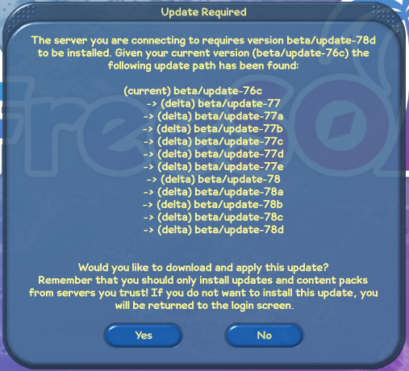
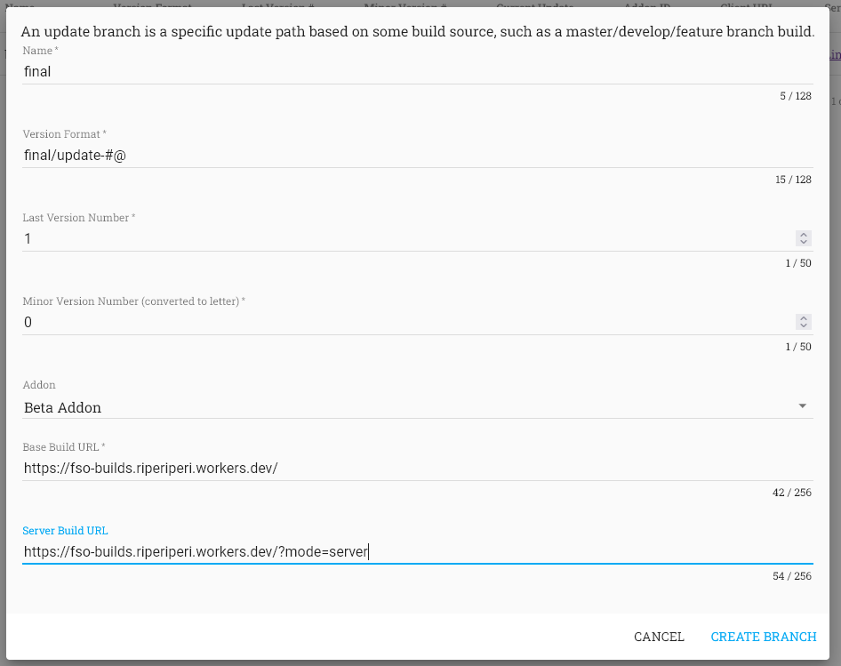
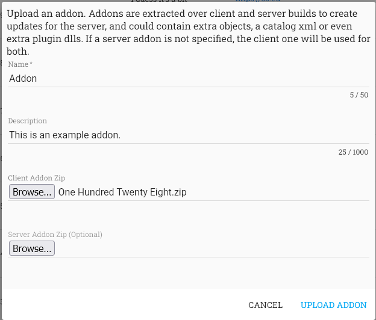
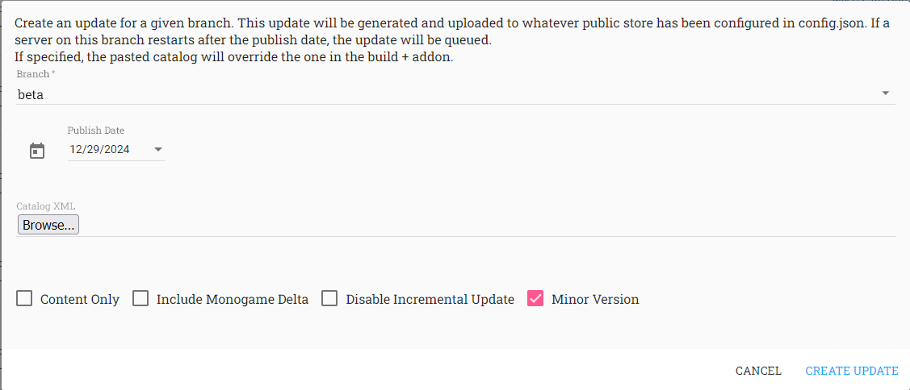

# Updates

Distributed updates are very important when running a FreeSO server as you will likely want to add objects or functionality to the game, which will require that everyone who connects to your server also has those changes. A system for this was used for the official server where updates were generated from the server on user demand from client/server builds and an "addon" zip, containing extra content to extract over the build to make the final client and server package.

There are effectively two modes for updates in FreeSO - simple and server managed.

Both use a `version.txt` in the client/server that specify the game version. This version is `dev-0` when building locally and when built by GitHub actions - it should be changed manually by the server owner to match updates they want to provide. If this differs between client and server, the game will ask the user to update to the version specified by the server.



This will download the update zip `patch.zip` (or delta update zips with name `path#.zip/path#.json`) into the `PatchFiles/` folder relative to the game. It will then start the updater process and close the game.

The builtin updater is a simple additional application called `update.exe` that simply replaces client files with those in the zips in `PatchFiles/`. After it completes, it restarts the game. The arguments that originally launched the game are passed to the updater, which will then be used to relaunch the game after the update completes.

Updating the server is a little more complicated - you either do it manually by extracting your new build files over the game, or by using the more complicated delta patch system built into the game. See below for more information.

## Simple Updates

This mode is used when there is _no_ `updateID.txt` file, and no updates in the `fso_updates` table. Set `updateUrl` in the `userApi` config to the URL for a full client zip that the user can download to match the server version. This should contain the same `version.txt` file as your server, and ideally the same content to prevent errors and desyncs.

When you make a client update, change the `version.txt` file on both the client/server, build a new client zip with your changes, upload it somewhere and change the `updateUrl` in config. Safely shut the server down, update the server binaries/content, then restart. Clients should be asked to download your new update when they log into the game.

Versions should be in the format `<branch>-<id>`. There's some splitting that goes on behind the scenes, so it should at least contain one dash.

## Server Managed Updates

This update mode relies on the server being able to upload update binaries, but allows you to deploy updates at an automated server restart without being present.

Managed client updates in FreeSO have two packages - an "incremental" or "delta" zip and a "full" zip, which are both released via GitHub actions and generated automatically off of the full zip of the previous version. This allows users to only download the files that change between updates, so they don't have to redownload all of your content every update.

They also have a manifest json, which contains a list of changed files with before/after hashes, so that the patcher can verify that the incremental patch can actually be applied to the source.

When a client connects to a server and sees multiple updates after their latest version, the game client can download the incremental patch for each and apply them in sequence to (again) avoid redownloading all content. If there are too many patches, or it can't find an incremental upgrade path for the user's version, then it'll just give up and download the full zip.

I can't remember if removal of files between updates is supported, but there the manifest json does allow it.

### IUpdateUploader Implementations

The FreeSO update generator supports three different types of upload, with their own config objects:

- Filesystem
  - Updates and Addons are placed into `basePath` on the local filesystem. If present, `baseURL` will be used to used to generate URLs that can be used by users and servers to download them. Otherwise, it will place the full path with `file:///` protocol into the addon/update config, which will only work on the server (ok for addons, not for updates).
- AWS
  - Updates and Addons are placed onto the given AWS bucket. It assumes that they can be given public access, and generates URLs that can be used by users and servers to download them.
- GitHub
  - Updates are published as GitHub releases. URLs are taken from the GitHub release artifacts so users and servers can download them. Addons are not published here.

Configuration for each is provided via objects in the `userApi` config section.

#### GithubUpdateUploader

This is the preferred method of generating updates. This mode will bundle update zips onto a single GitHub release for your update version, so it's easy for users to browse your update history via the GitHub website.

To use this uploader, add this configuration section to your `userApi` config object. See the Server Configuration doc for more info on config files.

```json
"githubConfig": {
  "appName": "FreeSO",
  "user": "riperiperi",
  "repository": "FreeSO",
  "clientID": "<id>",
  "clientSecret": "<secret>",
}
```

To set this up, you first need to create an OAuth App in GitHub. Go to https://github.com/settings/developers and register a new OAuth app. Homepage can be http://localhost:80 , callback can be http://localhost:80/github/callback .

Once it's configured, you'll be able to see a Client ID and Client secret that you can insert into the config above. Make sure your `appName` matches the name of your OAuth application, and `user` / `repository` match the repository through which you want to publish releases.

Now that this is done, you'll need to get an access token for the server. Boot up the server and browse to `/github` on the game API with a web browser. If it returns 404, then you either have no GitHub config or already have an `accessToken` specified (it should be omitted).

You'll be redirected to GitHub as it asks for application access. Accept, and you'll be redirected to a page that _only_ shows the access token. Copy this token into the JSON after the other properties:
```json
"githubConfig": {
//...
  "accessToken": "<token>"
}
```

After this is done, the updater should always try to publish client/server/delta zips through GitHub releases.

Addon zips are never uploaded to GitHub as they are not tied to releases. They will use AWS and fallback to Filesystem if AWS config is not present.

#### AWSUpdateUploader

The AWS uploader integrates with Amazon Web Services to let you upload updates and addons to an S3 bucket. 

To use this uploader, add this configuration section to your `userApi` config object. See the Server Configuration doc for more info on config files.

```json
"awsConfig": {
  "region": "eu-west-2",
  "bucket": "fso-updates",
  "accessKeyID": "<keyId>",
  "secretAccessKey": "<accessKey>"
},
```

You'll need to set up an S3 bucket on your AWS account to configure this uploader. The bucket should _not_ block all public access. Add the bucket and its region to the config object above, so the server can find it.

Use IAM to set up a user that the server can use to upload to the S3 bucket. They should be given `AmazonS3FullAccess`, which you can provide via a user group that includes the permission. There's probably a way to be more specific with the permission - it only requires write access on the bucket, and the ability to make files PublicRead.

Create an access key for the IAM user. Select "Other" as your use case, and continue until it gives you the access key and secret. _Save the access key and secret somewhere, you cannot see it again in future without recreating it_.

You can place the access key and secret into your config, and everything should be set up.

#### FilesystemUpdateUploader

The filesystem uploader is the final fallback if the other two are not available. It will copy completed update and addon zips to a local folder. It is still possible to use this to host public updates and addons, but you will need to configure an external webserver for that.

To use this uploader, add this configuration section to your `userApi` config object. See the Server Configuration doc for more info on config files.

```json
"filesystemConfig": {
  "basePath": "./public",
  "baseURL": "https://updates.freeso.org/" //example, if you were to host a webserver with the contents of ./public at that URL. omit if not set up
}
```

This uploader will always be used if the other two are not configured, with default path `./public` and no `baseURL`.

If you're using the GitHub uploader for updates and _haven't configured AWS_, then it's fine to use this uploader to manage addons _without_ configuring a web server. Addon zips are currently only accessed by the server to build updates, so if you don't have a distributed server setup then the `file:///` protocol links are enough for the update builder to function.

### Update Branches

An update branch determines where the base builds for your updates come from, what its name is, the format for its versioning, and keeps track of its current version number.

Here's how the official FreeSO server was configured:
- `branch_name`: `beta`
  - This is the name for the update branch. It should match the first part of the version string before the /.
- `version_format`: `beta/update-#@`
  - This is the format that version strings for updates are generated from.
  - `#` inserts the major version number, `@` inserts the minor version number (as a letter, starting at 'a').
- `addon_id`
  - Should point at whatever addon the next update should build with. This was changed often to add new content without pushing it to GitHub and waiting for a build.
- `base_build_url`: https://fso-builds.riperiperi.workers.dev/
  - The latest client build to base the next update on.
  - This worker downloads the last master build from Azure Pipelines on the FreeSO repo.
- `base_server_url`: https://fso-builds.riperiperi.workers.dev/?mode=server
  - The latest server build to base the next update on.
  - This worker downloads the last master build from Azure Pipelines on the FreeSO repo.
- `build_mode`: `zip`
  - `teamcity` is no longer used.
- `flags`: 0
  - Unused

You can also add Update Branches from the Admin Webapp:



### Update Addons

Update addons are zips of files that the server extracts over _both_ the client and server files before building them into finalized update zips and publishing them. Their main goal is to add content on top of everything built into the client, but it can also be used to replace or add binaries if you really wanted.

You can upload Update Addons by using the Admin Webapp, which allows you to perform a file upload from the browser directly to the admin API. The server will then upload your addon using AWS, or copied to the local filesystem if AWS config is not available.



Server Addon zips apply only to the server binary _instead_ of the client addon zip. Make sure your server addon includes the same core content as the client addon if you're going to use this. It was not used during operation of the FreeSO server.

Whenever you upload a new Update Addon, you need to change your update branch to point to it before building an update. You can do this via the Update Branches tab - just select your target branch, edit it and select the new addon.

### Building Updates

When you have a new build of FreeSO's client/server at your branch source URLs, or have a new Update Addon attached to the branch, you can build an update to schedule for the next server restart. You can do this through the Admin Webapp.



Select the update branch you wish to generate an update for from the list.

Set the Publish Date to the current date. Update scheduling was not tested or used, so I wouldn't rely on the option unless you want to fix it up if there are any issues.

- "Minor Version" increments the minor update version and leaves the major update version alone. If this is unchecked, the minor version is set to 0.
- "Disable Incremental Update" disables delta patching for this update. Mostly useful for debug.
- "Include Monogame Delta" includes changes in the Monogame dlls, which are excluded normally as they don't usually have functional changes, but do compile to a different file each time. 

You probably shouldn't use the "Catalog XML" or "Content Only" features here, as updating the catalog alongside adding objects/patches makes more sense, and the update delta will figure out if only content changed too.


While the update is building, you will be shown a progress bar and a description of what step of the update build the server is currently performing. You can actually close the admin app and the update building process will continue, though it will be harder to tell when it has completed. You can know for sure when the update is added to the `fso_updates` table.

When the server restarts, it will attempt to download the update to a local folder for the watchdog to extract.

Updating this way will automatically move you out of the simple update mode and into managed, as you'll now have an `updateID.txt` file with your server.

### Watchdog

The server watchdog (`watchdog.exe`) is essentially an updater for the server. It should be run before the server starts to process and apply any pending updates. The server will refuse to start if there's a newer version published, and will download the server zip and request that the watchdog is run.

The FreeSO server was run with a simple batch script that loops executing the watchdog and the server, so that when the server shuts down it automatically checks for updates, then restarts itself.

```bat
:loop

watchdog.exe run --core
dotnet exec FSO.Server.Core.dll

goto loop
```

...obvious downside here being that the only way to shut the server down for real is to manually close it on the server - so it doesn't restart itself. With this setup, you can restart into maintenance mode by setting that to `true` in the config before a restart, which will avoid people logging in.

You can get something similar on Linux with a bash script:

```sh
#!/bin/sh

while [ $? -ne 2 ]; do
    mono watchdog.exe run --core
    dotnet exec FSO.Server.Core.dll run
done
```

This does the same thing, but... uh, it can exit without restarting, if you shut down the shard without `Restart` option. Maybe you can use the exit code properly on Windows. I didn't try.

### Mystery Issues and Things to Improve
- The watchdog setup sucks.
- At some point, the server stopped downloading server update zips from AWS, but that should probably work fine from GitHub. AWS addon zip downloads still worked...
- Addon zips aren't the best solution to the problem, mostly the idea of using just one per update branch. They can get super large to be uploading as multipart file (over an https proxy) so you have to configure large upload limits and constantly reupload content that has been there in the last 300 addon zips. It could be more ideal to upload addon delta zips that just contain your new stuff, and the server combines them into the final addon that's applied to the client/server itself. Would mean smaller uploads for the user at least, and being able to push changes without downloading the last addon zip.
- There is no signature check on any of the update binaries or content. Ideally distributing arbitrary code to run on people's PCs should have more checks to make sure nobody intercepted it.