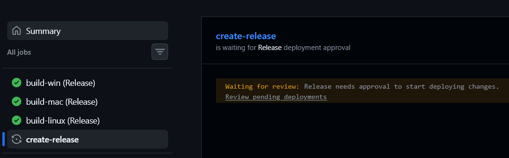
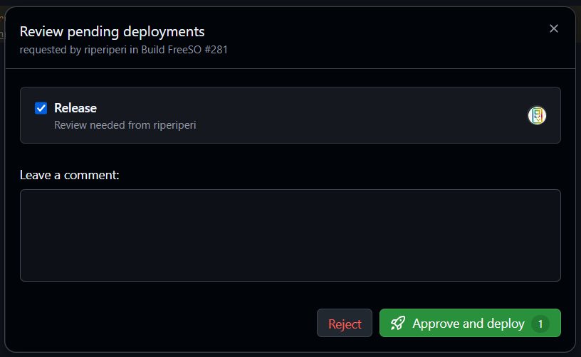

# Updates

Distributed updates are very important when running a FreeSO server as you will likely want to add objects or functionality to the game, which will require that everyone who connects to your server also has those changes. A system for this was used for the official server where updates were generated from the server on user demand from client/server builds and an "addon" zip, containing extra content to extract over the build to make the final client and server package.

There are effectively two modes for updates in FreeSO - official and server managed.

Official updates allow people to download the FreeSO client from our website and connect directly to your server with no additional downloads. A chain of trust verifies that their game client should only be automatically updated to a version signed by our CI. However, you aren't able to make any changes to the client this way, and as of right now you can't ship any extra Objects or Patches that FreeSO doesn't have. See the [Feature Wishlist](https://github.com/riperiperi/FreeSO/issues/306) for more info on ways this could be solved in future.

The alternative is building and maintaining your own Update channel. Because of FreeSO's MPLv2 license, the best way to go about making your own version of FreeSO is directly forking the project on GitHub, so I've made it as simple as possible for public forks to get started with the same CI that we're using.

## FreeSO GitHub Actions CI

When you push to a branch, three tasks will always run:

- `build-win`: Builds FreeSO via `FSO.IDE` (for Volcanic support) and `FSO.Server.Core`
  - Bundles dotnet, tries to enforce a "deterministic" build so that DLLs that shouldn't have any changes don't show up in the delta. Check the arguments in `dotnet.yml` for more info.
  - Artifacts are `FreeSOClient` and `FreeSOServer` (zipped by GitHub).
- `build-linux`: Builds FreeSO via `FSO.Unix` and `FSO.Server.Core`
  - Uses a single file publish, bundles in an `install.sh` script.
  - Similar build arguments to Windows, but with single file publish.
  - Artifacts are `linux.tar.gz` and `linux-server.tar.gz`.
- `build-mac`: Builds FreeSO via `FSO.Unix` and `FSO.Server.Core`
  - Uses a single file publish (.app)
  - Similar build arguments to Linux, does some extra stuff to ensure code signing isn't completely broken.
  - Artifacts are `mac.tar.gz` (contains the .app) and `mac-server.tar.gz` (contains the bin directory).

These will give you a full set of client and server, though without any assigned update channel (they'll be on the special "dev" channel).

## `create-release` and setting up Environments

FreeSO CI uses GitHub's environments to allow you to package and release any commit. You can add a publishing environment in `Settings > Environments` on your Repository - to work with the current CI you should at least have one called **"Release"**, though this can be changed in `dotnet.yml`.

If you want to publish a release, then you'll need to click **"Review pending deployments"** on the `create-release` task, and then Approve and deploy the action. This will only be available after all of the platform builds succeed, and should only be done if the artifacts haven't expired and you've properly configured the `FSO.UpdateBuilder`.

This action will run the `FSO.UpdateBuilder` to properly build your game update and release it on your GitHub repository. See below for more information.

## Configuring repository secrets and environment variables

The step for generating releases needs a few extra pieces of configuration to get working. Some of these should be added as secrets, so that it's a little harder for attackers to get a hold of in case of a GitHub breach.

This could be a little better - right now things like the platform list, channel names and branches are hardcoded into `FSO.UpdateBuilder` rather than being configurable on GitHub. See the next section for more information.

### Secrets (RSA key pair, newlines replaced with `^`):
- `FSO_UPDATE_PRIVATE_KEY`: RSA Private key, used to sign update binaries for the update channel.
- `FSO_UPDATE_PUBLIC_KEY`: RSA Public key, distributed to verify update binaries for the update channel.

NOTE: if these are blank, then your update will still be generated, it just won't be signed for the auto-updater.

### Variables
- `FSO_UPDATE_CHANNEL_URL`: Expected update channel url, embedded into the client `version.json` to allow the client to auto update.
  - Example: `https://freeso.org/api/update.json`

## `FSO.UpdateBuilder`

Since FreeSO has a lot of game content that doesn't change between update versions, it's important for us to have a method of calculating and distributing "delta" patches - update packages with only the files that changed since the last version. This means we need a script that can identify the previous update and calculate the delta using it - this is the main function of the `FSO.UpdateBuilder`, alongside collecting client/server platforms into a shared metadata file for use on an update channel.

`FSO.UpdateBuilder <workingDirectory>`

The update builder expects build artifacts to be present in folders named `<target>` and `<target>-server` in the given working directory. The CI automatically downloads and extracts the builds from the previous steps before running the update builder.

After downloading all of the artifacts, the CI runs `FSO.UpdateBuilder` with the following environment variables as arguments:

- `GH_TOKEN`: GitHub token, used to publish releases.
  - Provided by the CI action.
- `FSO_UPDATE_GITHUB_REPO`: `username/reponame` string, also used to manage releases.
  - Provided by the CI action.
- `FSO_UPDATE_CHANNEL_URL`: See last section.
  - On CI, sourced from the configured Environment Variables.
- `FSO_UPDATE_PUBLIC_KEY`: See last section.
  - On CI, sourced from the configured Secrets.
- `FSO_UPDATE_PRIVATE_KEY`: See last section.
  - On CI, sourced from the configured Secrets.
- `FSO_UPDATE_TARGETS`: Comma separated list of platform targets to include in the update build.
  - Forced to `windows,mac,linux` on CI right now, as it builds those three platforms.
- `FSO_UPDATE_INITIAL_VERSION`: Version to start counting from. After a version is released for a channel, it's incremented from that version instead.
  - Defaults to `v0.1.0`, CI doesn't check vars for it right now.

### Branch configuration 
- `FSO_UPDATE_PRIMARY_BRANCH`: The branch identified as the "primary" release channel. Any publishes from this branch use the primary channel's name and publish non-prerelease. Publishes from other channels use the secondary release channel and publish as pre-release.
  - Defaults to `master`, CI doesn't check vars for it right now.
- `FSO_UPDATE_RELEASE_CHANNEL`: Channel name to use for the primary release channel.
  - Defaults to `FreeSO Archive`, CI doesn't check vars for it right now.
- `FSO_UPDATE_RELEASE_SUFFIX`: Suffix to add to version tags on the primary release channel.
  - Defaults to empty string, CI doesn't check vars for it right now.
- `FSO_UPDATE_PRERELEASE_CHANNEL`: Channel name to use for the secondary release channel.
  - Defaults to `FreeSO Archive Beta`, CI doesn't check vars for it right now.
- `FSO_UPDATE_PRERELEASE_SUFFIX`: Suffix to add to version tags on the secondary release channel.
  - Defaults to `beta`, CI doesn't check vars for it right now.

### Operation

When run, the builder will generate version info to package with the client/server, upload the final packages to a GitHub release (as "full" zips), generate a manifest for the update as a whole with signatures+urls for all platforms, and optionally identify and build a delta from the last update published in the release/prerelease channel.

This script is responsible for generating two "installers":

If `mac` is in the targets list, then this script is also in charge of building the `.dmg` installer. This requires the tool to be run on a mac with the `create-dmg` npm tool globally installed. You'll notice that the `create-release` step actually runs on a mac runner for this reason.

if `linux` is in the targets list, then this script will package the game in `.tar.gz` as well as `.zip` to allow for easier installation on linux (without changing permissions). 

## `release-msi`

This step builds an msi installer for the Windows version of FreeSO, and retroactively adds it to the release that the update builder generated. This is done on a different step as it needs to happen on a Windows host, and the last step happened on macos. Don't you love technology?

It uses a small sub-script in the `FSO.UpdateBuilder` (`--windowsMsi` argument) to upload to the release that the last step generated.

## `FSO.UpdateWorker`
Because of more than a decade of pain experienced with Wordpress, the FreeSO website is actually completely static - built from source with Astro on CI and automatically uploaded to a static web server. As a side effect, there's not really an "API" for FreeSO related services now, which you'd think might be a problem for the Downloads page and the official update channel that needs to reflect the latest version published on GitHub.

This is where the FSO.UpdateWorker comes in. This is a simple script that infrequently polls the GitHub releases API on the target repository (`riperiperi/FreeSO`, for us) and builds two files that the _user_ fetches:

- `update.json`: The update channel, with a full version history built from GitHub releases in the target repository.
  - https://freeso.org/api/update.json
- `installer.json`: Information about the latest version in the primary update channel, used to populate the https://freeso.org/download page.
  - https://freeso.org/api/installer.json

My current setup just has the worker running on the webserver itself, which might not be ideal for simpler hosting but works for me. Here's how the configuration (`config.json`) works in that case:

- `githubToken`: GitHub token for accessing your repository data. Technically not required, but you _will_ run into aggressive rate limits without setting this.
  - Defaults to undefined.
- `authorName`: Repository owner on GitHub.
  - Default: `riperiperi`
- `repoName`: Repository name on GitHub.
  - Default: `FreeSO`
- `installerPlatforms`: Platforms to include installers for,
  - Default: `['windows', 'mac', 'linux']`
- `targetPath`: Filepath for the result `update.json` file.
  - Default: `update.json`
- `installerTargetPath`: Optional filepath for the result `installer.json` file.
  - Default: `installer.json`
  - If this is null, then an installer listing won't be generated.
- `clearCache`: If this is true, then the script will ignore existing updates and try to rebuild both files from scratch.

### Configuration for Remeshes
You probably just want to use our official remesh source, even if you're distributing your own client. These settings are available but you can omit them and use the defaults with no problem.

- `remeshChannels`: Remesh packages to pick up as channels.
  - Default: `["prod"]`
- `remeshAuthorName`: Repository owner on GitHub.
  - Default: `riperiperi`
- `remeshRepoName`: Repository name on GitHub
  - Default: `FSO.Remeshes`
- `autoRemeshChannel`: Remesh channel to use as the one that the client automatically downloads when none is currently installed. The client's public key must match the one from the remesh package for this to be respected.
  - Default: `prod`

## GitHub Actions limits and Private forks

By default, FreeSO will build client and server for all three platforms (Windows, Linux, Mac) for _every_ commit on the repository. These builds _include all game content_, so the artifacts can be around 300MB each, meaning that you're immediately using almost 2GB of artifact storage for one commit. You'll run into quota issues quite quickly with a private repository - you'll need to greatly reduce the artifact lifetime, disable platforms and even disable builds on entire branches to keep your CI functioning.

Public forks don't tend to run into this issue - GitHub appears to sort of write you a blank check to do whatever you want with your CI, as long as it's not blatantly misusing their service. Since you should be providing source releases with your modified game client anyways (due to our license), a public repo is the way to go for most situations.

Also, free accounts on GitHub don't get access to the full Environment system that allows you to manually approve and trigger followup workflows (like our `create-release` step), so on a free private repository you might find it ends up creating a release for every single commit. You'll have to disable the task or force it to only run on a certain branch (that you only push to for releases).
