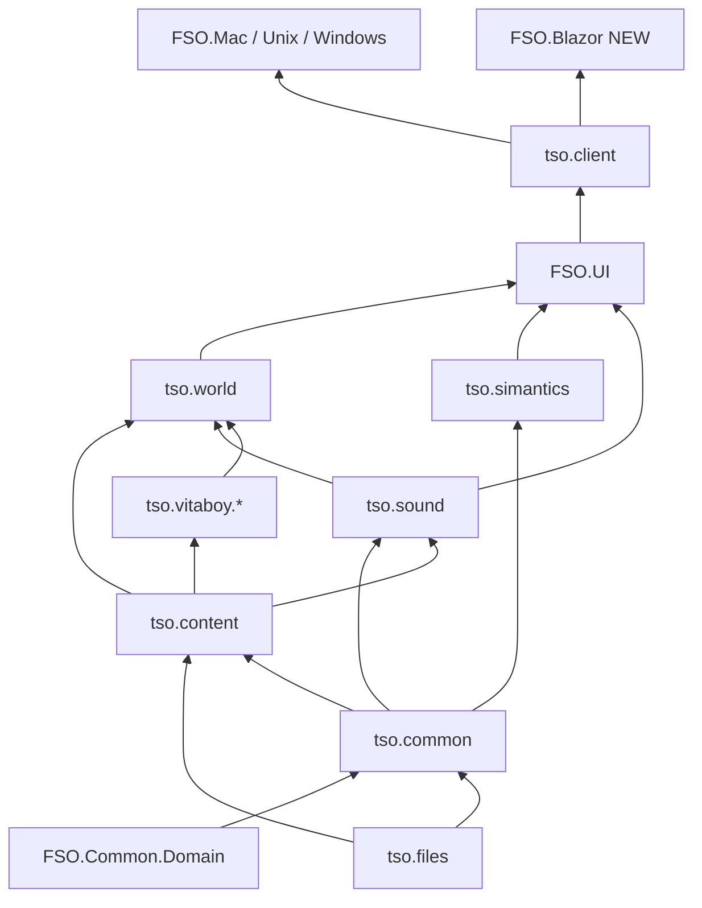

> Assessment from tree scan 2026-08-11 (swarm explore agent). Complements
> `BROWSER-VIABILITY.md` — that doc is partially stale (TF is **net9.0**, networking
> via `FSO.WsGateway` is proven, Thread list incomplete). Status: plan only.

# MonoGame → KNI BlazorGL migration

## 0. Goal / spike definition

**Spike goal:** BlazorGL tab loads a lot (terrain + objects + sims) via KNI WebGL, content over HTTP, optionally talk to Archive through existing WsGateway.

**Non-goals for spike:** authoring/IDE, WindowsDX path, first-run CAB/zip installers, Discord RPC, embedded lot server in-process.

**Package reality (KNI ≥4.x):** libraries take platform-free `nkast.Xna.Framework*` assemblies; platform heads take one of:

- `nkast.Kni.Platform.SDL2.GL` (DesktopGL replacement)
- `nkast.Kni.Platform.Blazor.GL` (browser)
- `nkast.Kni.Platform.WinForms.DX11` (WindowsDX — keep desktop-only)

Namespaces stay `Microsoft.Xna.Framework*` (API-compatible fork). See [KNI migrate 3.14→4](https://github.com/kniEngine/kni/blob/main/Documentation/articles/migrate_3_14.md).

---

## 1. MonoGame `.csproj` inventory (shipping client path)

All shipping client libs already **`net9.0`** (Windows head `net9.0-windows`). Version today: **DesktopGL / WindowsDX `3.8.5`** (`FSO.Mac` uses `3.8.*`).

### 1.1 Must retarget for any KNI client (library + heads)

| Path | TFM | Packages | Role |
|---|---|---|---|
| `TSOClient/tso.common/FSO.Common.csproj` | net9.0 | DesktopGL | Shared rendering/audio/utils |
| `TSOClient/tso.files/FSO.Files.csproj` | net9.0 | DesktopGL | IFF/FAR/SPR2 + Texture2D |
| `TSOClient/tso.content/FSO.Content.csproj` | net9.0 | DesktopGL | Content providers, effect sources |
| `TSOClient/tso.sound/FSO.HIT.csproj` | net9.0 | DesktopGL | HIT audio → XNA Audio |
| `TSOClient/tso.vitaboy.model/FSO.Vitaboy.csproj` | net9.0 | DesktopGL | Avatar model |
| `TSOClient/tso.vitaboy.engine/FSO.Vitaboy.Engine.csproj` | net9.0 | DesktopGL | Avatar render |
| `TSOClient/tso.world/FSO.LotView.csproj` | net9.0 | DesktopGL | Lot renderer |
| `TSOClient/tso.simantics/FSO.SimAntics.csproj` | net9.0 | DesktopGL | VM (math/Vector + little Graphics) |
| `TSOClient/FSO.UI/FSO.UI.csproj` | net9.0 | DesktopGL | UI framework |
| `TSOClient/tso.client/FSO.Client.csproj` | net9.0 | **DesktopGL + WindowsDX** | Game library |
| `TSOClient/FSO.Common.Domain/FSO.Common.Domain.csproj` | net9.0 | DesktopGL | Vector2/realestate only |
| `Other/libs/MSDFData/MSDFData.csproj` | (check) | DesktopGL | `FieldFontReader` / MSDF fonts |

### 1.2 Platform heads (stay native initially; add Blazor head)

| Path | TFM | Packages |
|---|---|---|
| `TSOClient/FSO.Mac/FSO.Mac.csproj` | net9.0 | DesktopGL |
| `TSOClient/FSO.Unix/FSO.Unix.csproj` | net9.0 | DesktopGL |
| `TSOClient/FSO.Windows/FSO.Windows.csproj` | net9.0-windows | DesktopGL + WindowsDX (+ `CopyMonoGameDLLs`) |

**New:** `TSOClient/FSO.Blazor/` (or `PackTools/FSO.BrowserClient` growing into one) → `nkast.Kni.Platform.Blazor.GL` + `FSO.Client`.

### 1.3 Exclude from browser shipping path

`FSO.IDE`, `tso.debug`, `FSOFacadeWorker`, `FSODroid`, `FSO.iOS`, `MigrationBackup/**`.

### 1.4 Ships with client but not browser-critical

`FSO.Server` is ProjectReferenced from `FSO.Client` and pulls DesktopGL for Color/Vector — trim or `#if` for Blazor if possible. `FSO.Server.Clients` / Protocol / DataService have **no MonoGame** — keep.

---

## 2. XNA surface + content IO hotspots

### 2.1 `using Microsoft.Xna.Framework*` (rough)

| Project | `using` count | Files with any XNA ref |
|---|---:|---:|
| `tso.client` | ~309 | ~205 |
| `tso.world` | ~148 | ~83 |
| `FSO.UI` | ~95 | ~60 |
| `tso.common` | ~71 | ~51 |
| `tso.simantics` | ~43 | ~42 |
| `tso.files` | ~34 | ~24 |
| `tso.content` | ~16 | ~14 |
| `tso.vitaboy.model` | ~12 | ~8 |
| `tso.sound` (HIT) | ~5 | ~6 |
| `tso.vitaboy.engine` | ~4 | ~3 |
| **Total** | **~737** | **~496** |

### 2.2 Disk IO hotspots to abstract first (HTTP → `Stream`/`byte[]`)

1. `tso.content/Content.cs` — `_ScanFiles`, `GetResource` → `File.OpenRead`
2. `tso.content/Framework/FileProvider.cs`
3. `tso.files/FAR3/FAR3Archive.cs`, `FAR1/FAR1Archive.cs`
4. `tso.files/Formats/IFF/IffFile.cs`
5. `tso.content/WorldObjectProvider.cs`, `UIGraphicsProvider.cs`, `RCMeshProvider.cs`, `ChangeManager.cs`
6. `tso.common/Utils/Cache/FileSystemCache.cs`
7. `tso.client/Rendering/City/CityContent.cs`, `Utils/GameLocator/*`

**XNB/effects:** `Content/OGL/`, `DX/`, `Effects/`, `Fonts/` via MonoGame `ContentManager`. Sources in `tso.content/ContentSrc/Effects/*.fx` (+ iOS GLES variants — closer to WebGL).

---

## 3. `new Thread(` — BROWSER-VIABILITY list vs today

### 3.1 Doc’s “five shipping files”

| File | Status | What it does |
|---|---|---|
| `tso.common/Utils/Cache/FileSystemCache.cs` | Still `new Thread(DigestLoop)` | Background disk-cache digest |
| `tso.common/Audio/MP3Player.cs` | **No `new Thread`** — already `Task.Run` | — |
| `tso.content/ContentPreloader.cs` | Still threaded | Background preload |
| `tso.simantics/NetPlay/Drivers/VMServerDriver.cs` | Still threaded | DropClient on sandbox ban |
| `tso.client/GameContent/ContentManager.cs` | **Gone** | — |

### 3.2 Additional Threads the spike must account for

| File | Role | Priority |
|---|---|---|
| `FSO.Server.Clients/Framework/AbstractRegulator.cs` | Login/city/lot regulator digest | **P0** |
| `FSO.UI/Framework/UIElement.cs` `Async()` | Many UI call sites | **P0** |
| `tso.files/RC/DGRP3DMesh.cs` | RC mesh worker pool | P1 |
| Zip/CAB extractors, Windows clipboard | Desktop first-run / OS | Exclude from browser |

---

## 4. Recommended migration order

### 4.1 Retarget to `nkast.Xna.Framework*` first (no platform package)

Bottom-up so DesktopGL and BlazorGL share one set of libs:

1. `FSO.Common.Domain`
2. `MSDFData`
3. `tso.files`
4. `tso.simantics`
5. `tso.common`
6. `tso.sound` / FSO.HIT
7. `tso.content`
8. `tso.vitaboy.model` → `tso.vitaboy.engine`
9. `tso.world` / FSO.LotView
10. `FSO.UI`
11. `tso.client` / FSO.Client — drop dual WindowsDX from the *shared* library; keep DX only on `FSO.Windows`

### 4.2 Stay DesktopGL / native-only initially

`FSO.Windows` / `FSO.Mac` / `FSO.Unix` heads, IDE/debug, first-run extractors, Discord RPC, WinForms clipboard, dual DX/GL linker.

After library swap, desktop heads use `nkast.Kni.Platform.SDL2.GL`.

### 4.3 Spike sequence (“eventually loads a lot”)

| Step | Deliverable | Exit criteria |
|---|---|---|
| S0 | Empty BlazorGL `Game` + clear color | Canvas paints — **DONE** (`PackTools/FSO.BrowserClient`) |
| S1 | Retarget Domain → Files → Common → Content (+ through Client) | libs build on KNI — **DONE for shipping lib chain**: Domain/Common/Files/Content/Vitaboy*/HIT/LotView/SimAntics/UI/Server/Client on `FSO_GRAPHICS` switch. Desktop heads still MonoGame platform packages. |
| S2 | Content seam over HTTP; one FAR/IFF → Texture2D | Texture on screen — **partial**: `GetResource` + FAR3 stream ctor + BasePath FileProvider wired; Blazor texture demo still open |
| S3 | Fetch `Content/OGL` XNBs; load effects (start **iOS/GLVer=2**) | Effects load |
| S4 | Retarget HIT; one SoundEffect under autoplay rules | Audio beep |
| S5 | LotView + Vitaboy; empty lot | Lot camera + floor |
| S6 | Thread→Task on play path | No `new Thread` on join |
| S7 | Wire WsGateway + full Aries session | Join lot |
| S8 | Full UI shell + catalog over HTTP | “Load a lot” demo |

---

## 5. Breakage surface on KNI BlazorGL

Almost no `#if WINDOWS|OPENGL` in shipping libs — branching is runtime via `FSOEnvironment` (`DirectX`, `GLVer`, `SoftwareDepth`, `GFXContentDir = "Content/OGL"`).

| Area | Notes |
|---|---|
| Dual MG assemblies | `MonogameLinker` / `AssemblyResolve` DX↔GL — **invalid on WASM** |
| Shaders / WebGL | Prefer iOS effect suffixes; expect technique cuts; force MSAA/tex compress off |
| Gamepad | `SM64Component` — known KNI web gap |
| DllImport | `user32`, `kernel32`, Discord |
| Filesystem | FAR/IFF/Content scan; FileSystemCache; UserDir |
| Threads | §3 — WASM default single-threaded |
| Networking | Mina TCP → WsGateway (done); still need full session path |

Lower risk than feared: `System.Drawing` nearly all IDE/Windows; MP3Player already Task-based; no direct OpenTK/SDL usings in client libs.

---

## 6. Concrete next steps

1. ~~Pin KNI 4.x; document PackageReference blocks for libs vs SDL2.GL vs Blazor.GL.~~ — pinned **4.2.9001** in root `Directory.Build.props` (`FSOKniVersion`); lib set in `msbuild/FSO.Xna.packages.targets`.
2. ~~`Directory.Build.props` switch: `FSO_GRAPHICS=MonoGame|Kni`.~~ — default `MonoGame`; build with `-p:FSO_GRAPHICS=Kni`. Opt-in projects set `<FSOUseXnaPackages>true</FSOUseXnaPackages>`.
3. ~~Prove clear-screen BlazorGL head.~~ — `PackTools/FSO.BrowserClient`.
4. `IContentBlobStore` / stream factory — HTTP seam exists (`FSO.BrowserContent`); still need to route `Content.GetResource` + FAR through it.
5. ~~Retarget remaining packages bottom-up (§4.1).~~ — shipping lib chain through `FSO.Client` done; desktop heads still on MonoGame platform packages.
6. Force `FSOEnvironment.GLVer = 2`, validate iOS FX → mgfx for WebGL.
7. Replace Threads in `AbstractRegulator`, `UIElement.Async`, `ContentPreloader`, `FileSystemCache`.
8. Gate GamePad / Discord / drag-drop / locators / zip-cab behind runtime flags.
9. Integrate WsGateway URL into Blazor config; continue Aries session work.
10. Refresh `BROWSER-VIABILITY.md` Thread § and networking § to point here / WsGateway.

### 6.1 S1 verify commands

```bash
# Desktop path unchanged
dotnet build TSOClient/FSO.Common.Domain/FSO.Common.Domain.csproj
dotnet build TSOClient/FSO.Mac/FSO.Mac.csproj

# KNI library path
dotnet build TSOClient/FSO.Common.Domain/FSO.Common.Domain.csproj -p:FSO_GRAPHICS=Kni
```

---

## 7. Retarget dependency sketch



## 8. Cross-links

- `BROWSER-VIABILITY.md` — viability framing (refresh Threads + networking)
- `PackTools/FSO.WsGateway/` — proven WS↔TCP
- `STATE.md` / `task_plan.md` Phase F
- `CLIENT-PORT-SCOPE.md` — historical MonoGame NuGet swap
