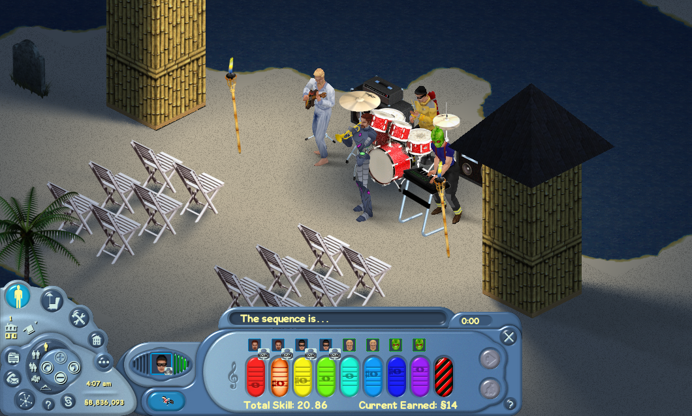
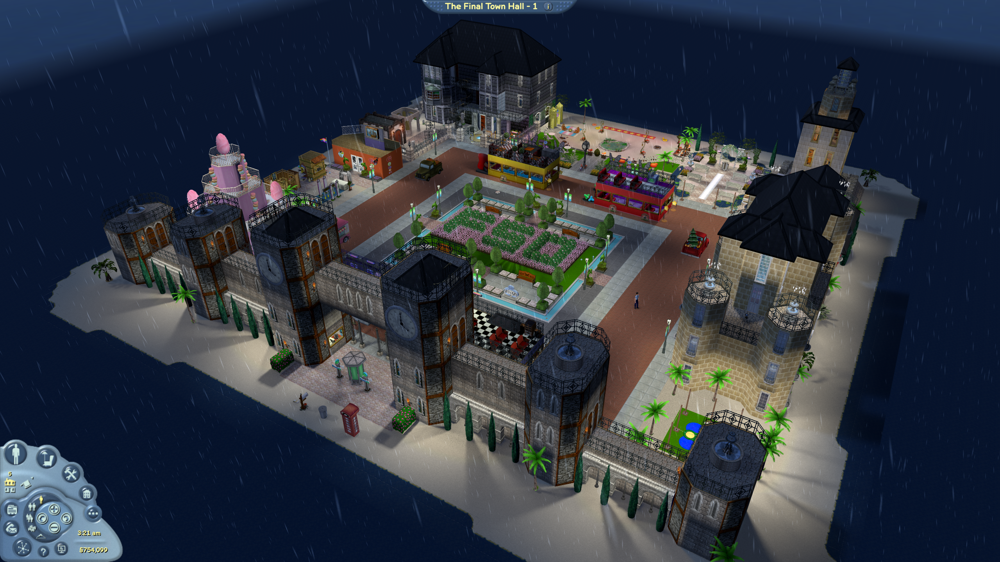

A full reimplementation of The Sims Online, using Monogame. While FreeSO aims to be faithful to the original game, it includes many quality of life changes such as hardware rendering, custom dynamic lighting, hi-res output and >2 floor houses. There are also some huge gameplay additions such as Neighbourhoods, toggleable 1st/3rd person controls, open lot borders and more.

While there used to be an official FreeSO server, FreeSO is now both a standalone application that allows players to self-host and join instances of the FreeSO server, and a technology base for other The Sims Online servers to build upon. Please see the https://freeso.org blog for more information.

FreeSO currently depends on the original game files (objects, avatars, ui) to function, which are available for download from EA servers. FreeSO is simply a game engine, and does not contain any copyrighted material in and of itself.

# The Sims 1 via Simitone

FreeSO is additionally a base project for an ongoing re-implementation of The Sims 1's engine, [Simitone](https://github.com/riperiperi/Simitone). This project is largely incomplete, but is in interesting novelty in itself.

The content system, HIT VM and SimAntics VM included within this repo support both TSO and TS1 game files - meaning that TS1 will still run in a limited sense under TSO's UI frontend within FreeSO. [Simitone](https://github.com/riperiperi/Simitone) fully restores TS1 gameplay by tying the neighbourhood and game systems together with a suitable UI frontend.

# 3D Mode

The FreeSO engine additionally supports a 3D mode, which allows you to see the game from a different perspective. 3D meshes are reconstructed at runtime from the z-buffers included with object sprites. FreeSO also generates 3D geometry for walls and floors at runtime, and switches to an alternate camera with different controls when the mode is enabled. 

A large selection of objects from the game have specially crafted 3D models created by the community, as the generated 3D meshes can be garbled due to small details not encoding well into sprite form, and gaps between multitile parts. These are maintained separately at the [FSO.Remeshes](https://github.com/riperiperi/FSO.Remeshes) repository.

The mode can be enabled via the launch parameter `-3d`. See the blog for more information. (http://freeso.org/the-impossible/)

# Volcanic

Volcanic is an extension of FreeSO that allows users to view, modify and save game objects alongside a live instance of the SimAntics VM. It features a vast array of resource editors for objects - the most prominent being the script editor. It allows for easy creation of new objects, and debugging of existing ones. Volcanic also functions when the FSO engine has loaded TS1 objects and other resources.

# Contributing
You can contribute to FreeSO by testing cutting edge features in the latest releases, filing bugs, and joining in the discussion on our forums!

FreeSO is largely complete - we only expect to see limited changes for bugfixes, extended support or a select few features that would improve the existing game experience. If you wish to make a large scale change, you should ask on Discord whether it's something that would be accepted or not.

* [Getting Started](https://github.com/riperiperi/FreeSO/wiki)
* [Project Structure](https://github.com/riperiperi/FreeSO/wiki/Project-structure)
* [Coding Standards](https://github.com/riperiperi/FreeSO/wiki/Coding-standards)
* [Pull Requests](https://github.com/riperiperi/FreeSO/pulls): [Open](https://github.com/riperiperi/FreeSO/pulls)/[Closed](https://github.com/riperiperi/FreeSO/issues?q=is%3Apr+is%3Aclosed)
* [Translation](http://forum.freeso.org/forums/translations.32/)
* [Forums](http://forum.freeso.org)
* [Blog](http://freeso.org)
* [Official Discord](https://discordapp.com/invite/xveESFj)

Looking for something to do? Check out the issues tagged as [help wanted](https://github.com/riperiperi/FreeSO/labels/help%20wanted) to get started.

## Prerequisites
* [Visual Studio Community](https://visualstudio.microsoft.com/vs/): With .NET 9.0
* [MonoGame](http://www.monogame.net): 3.8.5

## AI
**This repository does not accept AI assisted contributions in any form.**

FreeSO is a passion project born of the dedication and creativity of real people, each of whom has a storied history of playing the game, getting inspired by it, learning new skills to contribute and interacting with the community. Firing vague instructions at a prompt to make changes for changes sake is _not_ the kind of dedication that makes a project like this.

# License
> This Source Code Form is subject to the terms of the Mozilla Public License, v. 2.0.
> If a copy of the MPL was not distributed with this file, You can obtain one at
> http://mozilla.org/MPL/2.0/.
